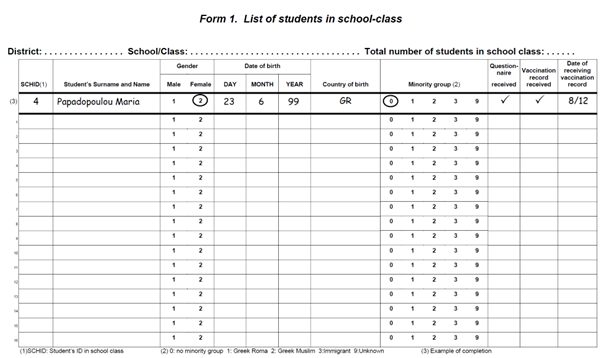
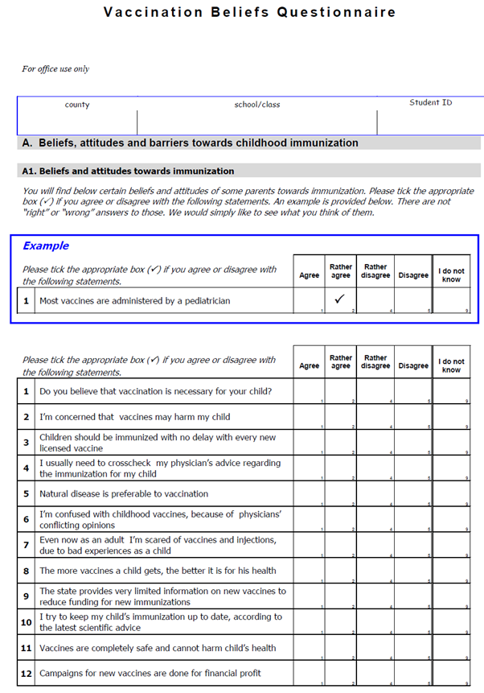
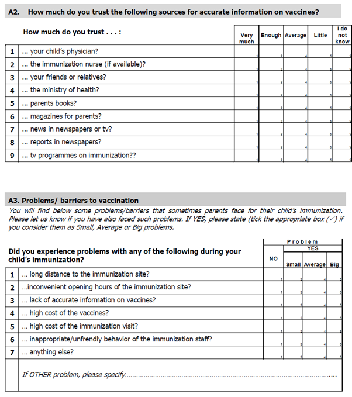
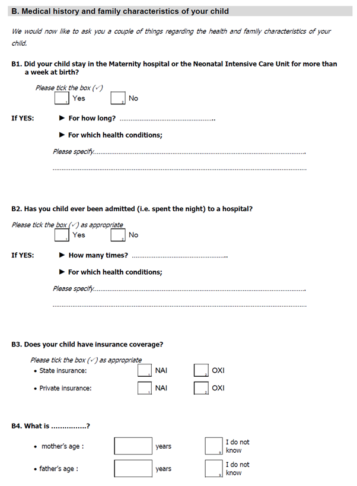
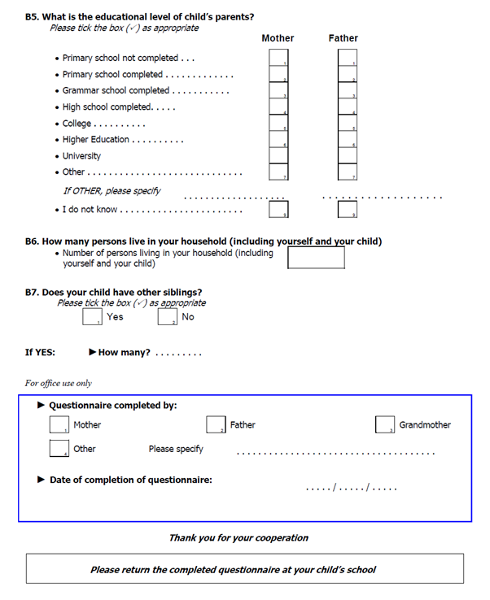
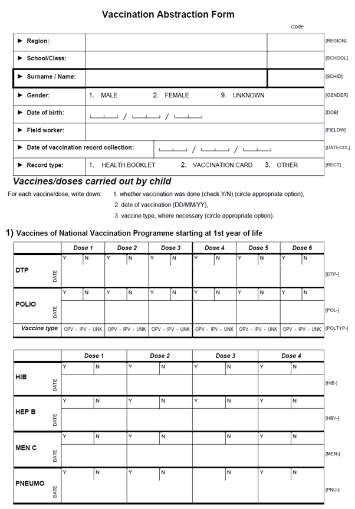
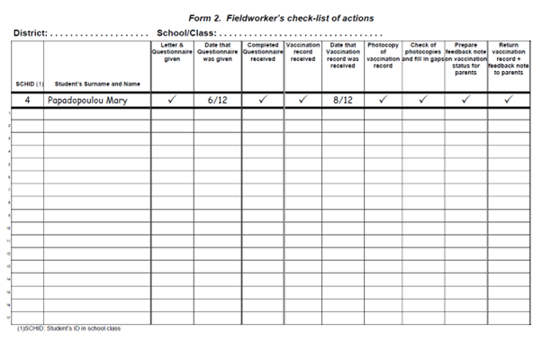

```{r setup, include=FALSE}
knitr::opts_chunk$set(echo = TRUE, 
                      eval = TRUE,
                      message = FALSE, 
                      warning = FALSE, 
                      ft.align = "left",
                      #fig.width = 12,
                      out.width = "100%")
```

\newpage

------------------------------------------------------------------------

# Introduction {.tabset .tabset-pills}

## Version history

This case study was originally written by the following authors:

-   Kostas Danis
-   Dimitris Papamichail
-   Takis Panagiotopoulos

An R companion guide for the computer practicals accompanying the case
study was developed in 2017 by:

-   Patrick Keating
-   Alexander Spina
-   Alexandre Blake

This was updated in 2018 by:

-   Ashley Sharpe

Further updates were made in 2022, to replace base R code with more
modern functions from `tidyverse` packages and to add an alternative
mixed-methods based approach for section 5 following the introduction of
this approach in the STATA version of the case study guide by Emily
White Johansson in 2022. The R guide was updated in 2022 by:

-   Amy Mikhail
-   Alexander Spina

All copyrights and licenses of the original document apply here as well.

\newpage

## Guide for use

This guide has been designed for use in two different ways; which one to
follow will depend on how experienced you are in using R for analysis,
and also your familiarity with the statistical concepts being covered.
We recommend that facilitators choose which method to follow after
discussing with their groups to determine the level of R experience and
background knowledge on the statistical concepts.

### Facilitator suggestions for group work

We recommend that regardless of which method you choose, the learning
objectives remain focused on gaining an understanding of the statistical
and epidemiological concepts to apply, particularly around sampling and
survey design.

*Method 1 - run as a paper discussion-based case study*

Choose this method if participants have limited to no experience with R,
or the group is very mixed, or there is less background familiarity with
the statistical concepts. The tasks in sessions 1 to 3 can mostly be
completed by hand with a calculator; for sessions 4 and 5 the results
tables can be the focus of the discussion. If you are using this method,
we recommend you click on the button to `hide code` at the top of the
html version of this document. This will make the text easier to read.
The `R coding tips` sections can be skipped, and participants can refer
to these later in their own time if they wish.

*Method 2 - run as a computer practical*

Choose this method if at least the majority of participants in the group
are already using R in their work and ideally, have also undertaken the
Outbreak and MVA module computer practicals in R. We recommend that a
Microsoft Teams meeting be set up for each group (even face to face
groups) so that facilitators can share their screen (with the sound
muted if in person). Facilitators should install all the required
packages on the computer they will be using, and attempt to knit this R
markdown file prior to the course.

It is also recommended that participants attempt to install all the
required packages before starting the course. It is advisable to
allocate some time outside of that allocated for this case study, to
troubleshoot package install problems, at the beginning of the course.
Prior experience has shown that installation problems can be time
consuming to resolve.

We suggest that the case study begins as for the discussion-based
method, with groups reading the background information and considering
the questions and how they would go about completing the tasks together.
Participants may then attempt to run the code on their computers, first
reading and following the R coding tips and then by running each R
markdown chunk and inspecting and discussing the output. For any
troubleshooting, facilitators can share their screens to demonstrate
solutions or explain particular aspects of how the code works, using
live demonstration techniques.

If participants are encountering difficult to resolve problems with R,
these are most likely to be due to their R set up and the security
settings on their computers (which are becoming increasingly complex in
most institutions). To avoid running out of time for conceptual
epidemiological discussions, we recommend encouraging participants to
pair up with other group members that do not have these issues, for the
rest of the session. Further troubleshooting with setup and package
install issues can then be addressed during the breaks.

### Prerequisites for participants

This guide is not intended to be an introduction to R, so if you wish to
follow the case study by running the R code, it is essential to have a
working knowledge of R syntax (particularly the syntax used by `dplyr`
and `tidyverse` packages). Understanding the R universe, syntax and the
way that packages work to undertake data cleaning, management and
manipulation tasks is a massive topic, and outside the scope of this
guide. If you are relatively new to R, however, you may find it helpful
to work through the main data management chapters in the online
[Epidemiologist R handbook](https://epirhandbook.com/en/) prior to
undertaking this case study. This is a relatively new resource that was
created especially for epidemiologists who want to get started using R.
Wherever possible, in this guide we have used the approaches
demonstrated in the Epidemiologist R handbook to undertake the generic
data manipulation tasks; you may therefore also find it useful as a
reference.

The R coding tips for each session focus principally on explaining the R
functions necessary to undertake the analytical aspects of the task in
question. Some guidance is also provided on ways to present the results.
When a new function is introduced, a description of how it works is
included in the text, and each line of code is also annotated.

Note that some prior knowledge about descriptive, single variable and
multivariable analysis is expected from previous modules (i.e. Outbreak
module, MVA).

\newpage

## Setup

### R guide structure

This guide is for participants who wish to undertake the RAS vaccine
coverage case study using R as the primary analysis software. All the
information required to complete the case study has been included. The
following materials have been provided:

1.  This guide, available as an interactive HTML file to view in your
    browser
2.  This guide, available as a static Microsoft Word document for
    printing
3.  `packages2install.R`: R script for installing the required packages
4.  `data`: folder containing all the data sets required for this case
    study
5.  `RAS_VC_R_code.Rmd`: R markdown file with the coding solutions for
    each task

You may find it easier to view and work through the html file in your
internet browser, as it has the following advantages:

1.  You can use the interactive contents links to jump to different
    sessions or tasks throughout the document
2.  Each practical session is presented in a separate tab
3.  You can use the `code` buttons to reveal or hide the code chunks

The R markdown file can be used to run each chunk of code and explore
the results as is, or alternatively, to modify the code if participants
wish to explore the R functions in more depth.

The case study is broken into 5 sessions, each of which consist of one
or more tasks to complete. For each session, you are presented with the
following sub-sections:

-   Introductory background (text)
-   Task description (text)
-   R coding tips (text and code)
-   Answers to the questions and tasks (tables and text)

*A note on similarities with the STATA case study guide:*

This R guide has been aligned as far as possible with the original STATA
guide; this means that the same statistical methods are used in both
guides. However, you may find minor differences in the numeric results;
this is usually due to differences in rounding or minor differences in
the calculations between the two software platforms. None the less, the
results from both platforms should yield the same interpretation.

\newpage

### R packages

It is advisable to have up-to-date versions of R and RStudio installed.
The code in this guide was updated and tested using:

-   R version 4.1.3 (2022-03-10)
-   RStudio version 2022.02.0 Build 443

This guide uses packages from the `tidyverse` which are being used more
and more for data analysis, due to their easy to read and efficient
coding syntax.

The packages required for this case study can be installed by running
the code below. This code has also been made available as a separate R
script. It uses the `pload()` function from the `pacman` package as this
will check the user's library for required packages, install them if
they are missing, and then load them into the current R session. Once
the packages are installed, you will also need to rerun this code chunk
at the beginning of each session, to ensure that all the required
packages are loaded.

```{r packages, results='hide', message=FALSE, warning=FALSE}

# Packages to install *before* running pacman pload():
#####################################################

# Ensures the package "pacman" is installed
if (!require("pacman")) install.packages("pacman", quiet = TRUE)

# Ensure the package "remotes" is installed
if (!require("remotes")) install.packages("remotes", quiet = TRUE)

# Install the epikit package from Github:
if (!require("epikit")) remotes::install_github("R4EPI/epikit", quiet = TRUE)

# Install the sitrep package from Github:
if (!require("sitrep")) remotes::install_github("R4EPI/sitrep", quiet = TRUE)


# Install and/or load required packages:
########################################
pacman::p_load(
  
  # Project and file management
  #############################
  here,      # file paths relative to R project root folder
  rio,       # import/export of many types of data
  rmarkdown, # reading and printing RAS R markdown guide
  knitr,     # reading and printing RAS R markdown guide
  
  # Package install and management
  ################################
  pacman,   # package install/load
  remotes,  # install from github
  
  # General data management
  #########################
  tidyverse,   # includes many packages for tidy data wrangling:
  #dplyr,      # data management
  #tidyr,      # data management
  #ggplot2,    # data visualization
  #stringr,    # work with strings and characters
  #forcats,    # work with factors 
  #lubridate,  # work with dates
  #purrr       # iteration and working with lists
  janitor,     # data cleaning
  
  # Summary tables:
  #########################
  flextable,   # Creating printable summary tables
  officer,     # Fine tuning flextables
  gtsummary,   # making descriptive and statistical tables
  smd,         # Helper functions for gtsummary tables
  labelled,    # Labelling variables and values
  scales,      # helper functions
  Hmisc,       # Summary functions
  
  # Analysis:
  #########################
  pps,         # Probability proportional to size (PPS) sampling
  sampler,     # Calculate sample size
  srvyr,       # Create survey design and calculate vaccination coverage
  survey,      # Support for srvyr functions
  fixest,      # Multivariable models with multiple fixed effects
  broom.mixed  # Extract tidy table of mixed effects model results
)

# Check for and install Github packages:
pacman::p_load_gh(
  
  # Packages for survey analysis and mixed effects:
  #################################################
  "R4EPI/epikit",     # Functions for survey analysis
  "R4EPI/sitrep"      # Function wrappers for survey analysis
)

```

We recommend that when you run this code for the first time, you check
the output carefully for any errors that could indicate a failure to
install some packages. If you do encounter any errors or other
difficulties, please ask a facilitator for help during the pre-case
study session that is dedicated to this.

A useful test to ensure packages have been installed correctly, is to
close RStudio after running this code the first time, then reopen
RStudio and run this code chunk. If you find that R is still trying to
install packages, this likely means that some packages failed to install
the first time. If all packages and their dependencies installed
correctly the first time, rerunning this code chunk should simply load
the packages into your R environment.

### Data management

**File organisation:**

The R practical material for this case study is stored in a folder
called `rvcs_2022`. Please download this folder from EVA and save it on
your computer. We recommend saving this file to a location that is not
connected to OneDrive or to any other Shared Drive, if possible, as this
can sometimes interfere with package installs or other functionality.

There is an R project file (`.Rproj`) in this folder and we suggest you
begin this practical session by double clicking on this file to open it.

In the `Files` pane of your RStudio window, you should see an R markdown
file called `RAS_vaccine_coverage_case_study_R_code.Rmd` . Click on this
file to open it. It contains all the code chunks that are also present
in this guide, but without explanatory text. This file is for you to run
and explore the code in each chunk, modify it if needed and make your
own notes.

The data sets have been stored in a sub-folder called `data`.

Note that the relative file paths used for importing data in this guide
assume the above folder structure.

**Importing data sets:**

The data sets can be easily imported using the `import()` function from
the `rio` package, combined with the `here` package to construct
relative file paths.

Most of the data sets are STATA `.dta` files, while the data required
for the first three excercises is saved in a Microsoft Excel workbook.
Both file types can be read in to R using `rio::import()` and specifying
the relevant arguments.

The data dictionary for each data set is included in the appendices at
the end of this guide.

\newpage

## Case study

### Description

This case study is built around a national survey that used stratified
cluster sampling to estimate the vaccination coverage of six year-old
children in Greece and to identify predicting factors of complete and
timely vaccination status. Teaching methods will include presentations,
interactive exercises and exercises using computers.

**Objectives**

The aim of this case study is to equip participants with the tools to
design and conduct a cross-sectional study to estimate vaccination
coverage and analyse data from a cross-sectional survey. At the end of
the course, participants should have acquired the following skills:

*1. Epidemiological skills:*

-   Select the appropriate method to estimate vaccination coverage
-   Understand the principles of basic sampling methods, including
    stratification and cluster sampling
-   Select an appropriate sampling scheme
-   Calculate the required sample size
-   Identify methods of data collection to estimate vaccination coverage
-   Interpret the results of the various analyses
-   Communicate findings

*2. Computer skills:*

-   Calculate sample size
-   Automatically select study participants from a sampling frame with
    different sampling methods
-   Perform descriptive analysis by calculating weighted proportions
-   Calculate vaccine coverage estimates using a survey design
-   Conduct an analytical study using a cross-sectional survey with a
    stratified cluster sampling design
-   Present descriptive and analytical results in publication-ready
    tables

**Case study sessions**

This case study consists of the following 5 sessions:

-   *Session 1:* Sampling

-   *Session 2:* Sample size calculation

-   *Session 3:* From analysis plan to data collection

-   *Session 4:* Descriptive statistics with weighted proportions

-   *Session 5:* Analysis of associations with having a fully vaccinated
    child

Duration of the case study: 7-9 hours (additional 3-4 hours for the
optional sessions)

### Background

Vaccine-preventable diseases are still a public health burden worldwide,
largely due to suboptimal vaccination coverage, and constitute an
important component of the health care debate in many countries. To
improve vaccination coverage and reach high immunisation levels, the
reasons for inadequate vaccinations need to be identified and addressed.

**Vaccination in Greece**

In Greece, vaccines included in the National Vaccination Programme (NVP)
(Box 1) are provided free of charge to all residents (including
immigrants) in primary health care centres or health insurance clinics.
Childhood vaccination coverage is not monitored routinely. Several
ad-hoc studies have been conducted occasionally at local level using
non-representative samples. Most of the current knowledge on
immunisation uptake is based on two national population-based surveys
conducted in 1997 and in 2001 using representative samples of children
attending the first year of Greek Grammar school (children born in 1991)
and of two-year olds (children born in 1997), respectively. Results of
those surveys showed high vaccination coverage [93.5% and 98.9% for the
3rd dose of diphtheria-tetanus toxoid and pertusis (DTP) vaccine; and
89.1% and 93.7% for the 1st dose of measles-mumps-rubella (MMR) vaccine
in 1997 and 2001, respectively]. However, an outbreak of measles in 2006
revealed low coverage among the Roma minority (1% of the population) and
immigrants (8% of the population) who accounted for 55% and 15% of all
cases, respectively.

**Box 1-** *Recommended childhood vaccination schedule according to the
National Vaccination Programme (NVP) at the time of the study in Greece*

```{r s0_greece_epi_table, echo=FALSE}

grepi <- rio::import(file  = here("refs", "Guide_tables.xlsx"), 
                     which = "Greece_EPI") %>% 
  
  flextable::qflextable() %>% 
  
  flextable::align(j = 2:11, align = "right", part = "all") %>% 
  
  flextable::set_table_properties(width = 1, layout = "autofit") %>% 
  
  footnote(i = 1,
           j = c(2,4,5), 
           part = "header",
           inline = FALSE,
           ref_symbols = "a", 
           value = as_paragraph(
             "DTaP, IPV & MMR were introduced in the NVP before 1990")) %>% 
  
  footnote(i = 1, 
           j = c(3,6), 
           part = "header", 
           inline = FALSE, 
           ref_symbols = "b", 
           value = as_paragraph(
             "Hib & HepB introduced in 1998 and 2002, respectively")) %>% 
  
  footnote(i = 1, 
           j = c(7:9), 
           part = "header", 
           inline = FALSE, 
           ref_symbols = "c", 
           value = as_paragraph(
             "MCV, PCV7 and Var introduced in 2006 (although MCV was available in pharmacies since 2001)"))

# Print table:
grepi

```

**Scenario**

You work at the national public health institute and you are asked to
provide data on vaccination coverage of children in Greece and identify
the potential reasons for low vaccination uptake.

\newpage

## Glossary

| Acronym or term | Meaning                                       |
|:----------------|:----------------------------------------------|
| BCG             | Bacillus Calmette-Guérin                      |
| DTP             | Diphtheria-Tetanus-Pertusis vaccine           |
| DTaP            | Diphtheria-acellular Tetanus-Pertusis vaccine |
| dt              | reduced diphtheria toxoid-Tetanus toxoid      |
| Hib             | Haemophilus Influenzae type b                 |
| IPV             | Inactivated Poliomyelitis Vaccine             |
| MMR             | Measles Mumps Rubella vaccine                 |
| OPV             | Oral Poliomyelitis Vaccine                    |
| HepB            | Hepatitis B                                   |
| HepA            | Hepatitis A                                   |
| MCV             | Meningococcal Conjugate Vaccine               |
| Men C           | Meningitis C                                  |
| PCV7            | Pneumococcal Heptavalent Vaccine              |
| PR              | Prevalence Ratio                              |
| RR              | Risk ratio / Rate ratio                       |
| OR              | Odds Ratio                                    |
| 95% CI          | 95% Confidence Intervals                      |

\newpage

------------------------------------------------------------------------

# Practical sessions {.tabset .tabset-pills}

## S1: Sampling frames

**Session overview**

This session focuses on how to select a representative sample from a
specified population, using basic and more complex sampling methods.

By the end of this session, participants should be able to:

-   understand the principles of basic sampling methods
-   identify different sampling design options for a vaccination
    coverage survey
-   understand the meaning of target and sample populations, primary and
    final sampling units, and sampling frame
-   understand complex designs, especially cluster sampling and
    stratification
-   identify the necessary number of sampling units in different strata
    in a survey
-   draw a simple random sample
-   draw a systematic sample
-   generate random numbers using R
-   draw a simple random sample with probability proportional to size

This session consists of 6 Tasks:

-   *Task 1.1* -- Sampling strategy
-   *Task 1.2* -- Use stratification
-   *Task 1.3* -- Select a simple random sample (generate random
    numbers)
-   *Task 1.4* -- Select a systematic sample
-   *Task 1.5* -- Select a sample with probability proportional to size
-   *Task 1.6* -- Cluster sampling

### 1.1: Sampling strategy

**Background:**

The aim of the study was to estimate the vaccination coverage among
6-year-old children in Greece and identify reasons for incomplete
vaccination status.

The specific objectives were to:

1.  estimate the vaccination coverage of 6-year-old children for all
    vaccines included in the National Vaccination Programme:
    -   overall in Greece
    -   by geographical region (6 regions, urban and rural areas)
    -   by minority group (i.e. immigrants, Greek Muslims, Greek Roma)
2.  examine the associations between socioeconomic status, parental
    beliefs and attitudes towards immunisation, and perceptions of
    barriers to vaccination on complete vaccination status among 6-year
    old children

**Task instructions:**

Discuss and answer the following questions:

1.  What sampling frames might be available?

2.  What are some necessary prerequisites for using them?

3.  What options of sampling schemes would you consider?

4.  What are the advantages and disadvantages of each one?

5.  Explain in plain language the sampling strategy chosen by the
    researchers and describe the different steps of sampling.

6.  In the selected sampling design:

    -   what is the target population?
    -   what is the study population?
    -   what are the primary sampling units?
    -   what are the final sampling units?
    -   what sampling frame could be used?

7.  "Samples of approximately equal size were selected in each region":

    -   Why do you think this was done?
    -   What complexity does it introduce?

\newpage

**Researcher selected strategies:**

*Q 1 - 2 (Sampling frames and prerequisites):*

You may consider the following sampling frames:

-   Resident registries from local authorities (complete and updated)
-   Patient registries from primary care services (relatively complete)
-   Child vaccination registries (if available)
-   Telephone directories to identify families (exhaustive - there are
    usually multiple operators and networks)
-   Social security registry of parents (information on children might
    not be available)
-   School registries (in this case, a large proportion of the
    population should attend school)

In this survey the researchers decided to take a sample of 1st grade
school children.To assess whether this study population is appropriate,
it would be necessary to have information on:

-   whether attendance in primary school is compulsory
-   provision for children with handicap or other health problems and
    for children living in special social circumstances
-   possible educational institutions for 6 year-old children other than
    "primary schools"
-   existence of special education, private schools, minority schools,
    religious schools etc.
-   school attendance of the general childhood population as well as of
    children belonging to special groups (e.g. immigrants, Roma etc.).

A full list of school children was impossible to obtain. Nevertheless,
it was feasible to get a list of all schools in the country, with number
of first grade classes in each school.

*Q 3 - 4 (Sampling schemes, advantages and disadvantages):*

The following options of sampling schemes should be considered:

A. Sampling of children (final sampling units):

-   1st stage: cluster sampling with schools as clusters of children
-   Advantage: simplicity
-   Disadvantage: large clusters if no further sampling in 2nd stage is
    used

B. Two-stage cluster sampling:

-   1st stage: cluster sampling with schools-classes as clusters of
    children
-   2nd stage: all children in school or school-class
-   Advantage: smaller clusters than previous option, simple to organise

\newpage

C. Multi-stage cluster sampling:

-   1st stage: cluster sampling with school-classes as clusters of
    children
-   2nd stage: sample of children in each school-class from the 1st
    stage
-   Advantage: more efficient design

D. Sampling of school-classes or schools (clusters, primary sampling
units):

-   Simple random sample of school classes or schools
-   Advantage: theoretically correct, simple to analyse
-   Disadvantage 1: wide distribution across country (practical
    difficulties)
-   Disadvantage 2: adequate sample size / region not ensured (see
    objectives)

E. Systematic sample of school classes or schools:

-   No particular advantage compared to simple random sampling

F. Stratification by region:

-   Advantage 1: more efficient design (the more the regions are
    heterogeneous between and homogeneous within themselves in terms of
    vaccination coverage, the more efficient the design, i.e. the
    narrower the confidence intervals)
-   Advantage 2: adequate sample size in each region is ensured

G. Stratification by region and by urban/rural area:

-   Advantage: more efficient design (as for regional strata above).


The researchers decided to use the following sampling strategy:
stratified cluster sampling of first-grade school children, using school
classes as clusters and stratification by region (see map) and
urban/rural area; approximately equal sample size was used in each
region, and within each region sample size in urban/rural areas was
proportional to size; all children in each school-class were selected.

*Q 5 (Explain chosen sampling strategy):*

A national sample of first grade school children was selected using the
following sampling strategy:

-   The country was divided into six geographical region (Figure 1.1)
-   Each region, apart from the capital region (Attica), was further
    subdivided into urban and rural areas, to create 11 strata.
    According to the National Statistical Authority of Greece, urban
    areas are defined as towns/cities with 2,000 population or more,
    while rural areas as villages/towns with less than 2,000 population
-   A sample of approximately equal size was taken in each region
-   Within each region, samples were selected with probability
    proportional to the size of urban and rural areas
-   School classes were used as clusters of children
-   A simple random sample of school classes was selected in each
    stratum
-   All children in the selected school classes (clusters) were selected
    in the final sample.

*Q 6 (Metrics for chosen sample design):*

The following metrics describe the chosen sample design:

-   Target population: 6-year-old children in Greece
-   Study population: children attending first grade of primary school
-   Primary sampling units: school classes
-   Final sampling units: individual children
-   Sampling frame: list of all schools in each stratum, with number of
    first grade classes in each school.

*Q 7 (Rationale for selecting samples of equal size per region):*

The researchers had set as their objective to estimate vaccination
coverage by geographical region. Therefore, the sample size would have
to be adequate in each and every region in order to have estimates of
acceptable precision. As a consequence, the researchers chose to get
samples of equal size in each region. (In fact, they aimed at a somewhat
higher precision for the region of Attiki, and therefore the sample size
for this region was somewhat larger).

As the population of each region is different, opting for equal sample
size in each region leads to different sampling fractions for each
region. This means that weighting should be used in the analysis (for
national level results) to take account of the different sampling
fractions of the regions. This increases the complexity of the analysis.

\newpage

### 1.2: Stratified proportional sampling

**Background:**

Stratified sampling is used when the population consists of distinct
subgroups (strata), which differ with respect to the feature under
study. In this study, researchers expected urban and rural areas in each
region to be different in terms of vaccination coverage. Therefore, the
same proportion of clusters (school classes) was taken from each stratum
within a region to ensure that they were all adequately represented.

Your first task is to calculate the number of classes to sample in each
region and rural / urban stratum.

**Task instructions:**

Using the data provided in table 1.2 below (which can be imported into R
from the `table1_2` worksheet of the `Sampling_frames.xlsx` Microsoft
Excel workbook in the `data` sub-folder):

1.  Within each region, calculate the number of clusters (school
    classes) to sample from;

2.  Calculate the number of classes for each urban / rural stratum
    relative to the population size;

3.  Aim to include 50 school classes from each region;

4.  Assume that all school classes have an equal number of students;

5.  Append your results to table 1.2 (percentage and number of classes
    to sample for each urban and rural stratum in each of the 6 regions)
    to complete it.

| Region                 | Urban  | Rural  | TOTAL  |
|:-----------------------|:------:|:------:|:------:|
| Thraki                 | 11624  |  6884  | 18508  |
| Macedonia-Thessalia    | 116322 | 47101  | 163423 |
| Ipeiros-Ionian Islands | 11446  | 15449  | 26895  |
| Peloponissos-Sterea    | 55770  | 44132  | 99902  |
| Attiki                 | 174493 |  1667  | 176160 |
| Crete-Aegean Islands   | 36374  | 24752  | 61126  |
| **TOTAL**              | 406029 | 139985 | 546014 |

: Table 1.2 - Number of children aged 5 - 9 years in Greece by region
and urban/rural area

**R coding tips:**

First, import the summary data from table 1.2.

This table is currently in wide format, but to calculate the number of
classes to sample from in each strata, it needs to be converted to long
format (i.e. 'tidy data') so that a single column defines the strata
(urban or rural) and another column contains the population for each
stratum. We can do this with the `tidyr::pivot_longer()` function.

We can then calculate the relative proportions in each stratum and from
there determine the number of school classes to sample (out of 50) for
each stratum within each region:

***Table 1.2 -** Updated with proportions and number of classes to
sample per stratum*

```{r sframe_import}

# Import sample frame for regions:
regions <- rio::import(here::here("data", "Sampling_frames.xlsx"),
                         which = "table1_2")

# Create new table for results:
nclasses2sample <- regions %>% 
  
  # Convert table to tidy data:
  tidyr::pivot_longer(cols = c(Urban, Rural),        # Convert to tidy format
                      names_to = "Stratum",          # Store strata in new col
                      values_to = "Population") %>%  # Store population in new col
  
  # Calculate proportions and number of classes to sample:
  mutate(Proportion = Population/Total,              # Calculate proportions
         Nclasses = round(50*Proportion, digits = 0))# Calculate number of classes


#################
# Print results:
################

# Convert to a flextable:
nclasses2sample_pub <- flextable::qflextable(nclasses2sample) %>% 
  flextable::set_table_properties(width = 1, layout = "autofit")

# Print:
nclasses2sample_pub

```

\newpage

### 1.3: Simple random sampling

**Background:**

Table 1.3 is part of the sampling frame for the stratum "rural areas of
the region of Peloponissos-Sterea", where all schools have only one
first grade school-class.

Questions to answer:

1.  What would be the necessary steps to select a simple random sample
    of 22 school classes from the sampling frame (Table 1.3)?
2.  What is the sampling fraction in this case?

**Task instructions:**

1.  Generate a simple random sample of 22 school classes using random
    number selection in a computer programme;

2.  Identify the selected school classes in the sampling frame (table
    1.3);

3.  Calculate the sampling fraction.

**R coding tips:**

The sampling frame (list of school classes in the Peleponissos-Sterea
region) can be imported from the `Sampling_frames.xlsx` workbook
(`table1_3` is the name of the worksheet).

The simple random sample of 22 classes can then be identified using the
`dplyr` convenience function `slice_sample()` to return a random subset
of 22 rows of the original sampling frame.

***Table 1.3 -** Simple Random Sample of 22 school classes*

```{r simple_random_sample}

# Import the sampling frame of school classes in Peleponissos-Sterea:
class_frame <- rio::import(here::here("data", "Sampling_frames.xlsx"),
                         which = "table1_3")

# Perform a simple random sample to select 22 classes from the list:
msrs <- class_frame %>% 
  
  # Subset the simple random sample of 22 classes:
  slice_sample(n = 22) %>% 
  
  # Arrange results in ascending order by ID:
  dplyr::arrange(ID)

#################
# Print results:
################

# Convert to flextable:
msrs_pub <- flextable::qflextable(msrs) %>% 
  flextable::set_table_properties(width = 1, layout = "autofit")

# Print:
msrs_pub

```

\newpage

The sampling fraction is the number of units sampled divided by the
total number of units in the sampling frame, i.e.:

$$
Sample Fraction = \frac{n}{N}
$$

where:

-   $n$ is the sample size and

-   $N$ is the total population included in the sampling frame.

```{r sample_fraction}

# Calculate the sampling fraction for this example:
sample_fraction <- round(22/nrow(class_frame), digits = 2)

#################
# Print results:
################

sample_fraction

```

\newpage

### 1.4: Systematic sampling

**Background:**

Systematic sampling is similar to simple random sampling, except that
the total sampling frame is divided by the desired number of sampling
units to select and every *nth* row of the sampling frame is selected
according to the result. This can be a useful sampling strategy when
subjects are being prospectively recruited to a study, when the total
size of the sampling frame is not yet clear or when it is necessary to
ensure consistent sampling over multiple days with an unknown number of
subjects recruited per day.

Questions to answer:

1.  What is the process for a systematic sample of 22 schools among 102
    schools?
2.  What are the advantages and disadvantages of using systematic
    sampling?

**Task instructions:**

1.  Use the same sampling frame as for the previous section
    (`class_frame`);

2.  Divide the total number of classes in the sampling frame by the
    desired number of units to sample (22) to calculate the group size;

3.  Randomly select one number *n* from this group size;

4.  Select every *nth* row of the sampling frame to produce the
    systematic sample;

5.  Limit the number of returned rows to the desired number of units to
    sample (22).

**R coding tips:**

After calculating the size of the groups to divide the sampling frame
into, we can select a random number from this group size using the base
R function `sample.int()`.

Note that you can ensure you always get the same number back by using
the `set.seed()` function - this way if you send your script to someone
else they would be able to reproduce the same sample.

This random number can then be fed into the `dplyr::slice()` command as
shown below to select every *nth* row of the sampling frame. Note that
if *n* is small / an early number in the sequence, an excess of rows may
be selected. If this happens, the returned rows can be limited to the
desired sample size by using the `dplyr::slice_head()` function:

***Table 1.4 -** Systematic sample of school classes*

```{r systematic_sample}

# Define the sampling interval - the n to systematically sample 
# (i.e. every nth row to choose):
sample_n <- as.integer(nrow(class_frame)/22)

# Calculate the random starting point for systematic sampling:
sample_start <- sample.int(n = sample_n, size = 1)

# Define rows systematically (every nth row) to filter the sampling frame: 
sample_rows <- seq.int(sample_start, nrow(class_frame), sample_n)

# Now subset the sampling frame and filter for every nth row:
msystematic <- class_frame %>% 
  
  # Select every nth row from the sampling frame:
  slice(sample_rows) %>% 
  
  # Limit the number of returned rows to the desired sample size (22)
  slice_head(n = 22)

#################
# Print results:
################

# Convert to flextable:
msystematic_pub <- flextable::qflextable(msystematic) %>% 
  flextable::set_table_properties(width = 1, layout = "autofit")

msystematic_pub

```

\newpage

*Advantages:*

As mentioned in the background to this task, systematic sampling can be
useful when you need to undertake prospective recruitment from a
theoretical sampling frame of unknown size (like the number of patients
attending a clinic on a given day). However, in the context of this case
study, we already have a well defined and complete sampling frame
(school classes, which also list the students in each class). Because of
this, a systematic sampling strategy won't provide any benefits over
other methods, and we can adopt the most straight-forward approach --
simple random sampling!

*Disadvantages:*

Bias can be introduced, if the sampling units are grouped in such a way
that particular characteristics occur at regular intervals Therefore,
the assumption made with systematic sampling is that there is no
underlying pattern in the sampling frame.

\newpage

### 1.5: PPS sampling

**Background:**

The researchers originally chose to use school classes as the sampling
units, because it was assumed that all classes had similar numbers of
students. An alternative sampling unit would be the schools themselves;
however unlike for classes, the number of students in each school varies
widely.

Probability proportional to size (PPS) sampling is a method that takes
varying sample sizes in the sample units into account. This helps to
avoid under-representing one subgroup in a study and yields more
accurate results.

In this case study, you have been provided with a list of schools in
urban areas of Attiki, which also indicates the number of grade 1
students in each school and the number of classes. This data set can be
imported from the `table1_5` worksheet in the `Sampling_frames.xlsx`
workbook. Schools can be selected adjusting for the size of the student
population, by performing PPS sampling. The column containing the number
of students in each school is used as input.

Questions to answer:

1.  What does "selection without replacement" suggest?

**Task instructions:**

1.  Use the sampling frame for Attiki schools in urban areas presented
    in `table1_5`

2.  Select 12 schools by probability proportional to size sampling
    *without replacement*

3.  List the schools that have been selected

**R coding tips:**

There are several packages available on CRAN that can perform PPS
sampling. In the example code below, we will use the `sampford()`
function from the `pps` package to perform the sampling without
replacement, which uses the classic method developed by [Sampford
(1967)](https://academic.oup.com/biomet/article-abstract/54/3-4/499/230469?redirectedFrom=fulltext).

We can use the indices in the results to filter the sampling frame for
the 12 selected schools (using `dplyr::slice()` as above).

Note that an alternative would be to use `dplyr::slice_sample()` and
supply probabilities for each school to the `weight_by` argument. To do
this you would have to calculate probabilities for each school:
`school_frame %>% mutate(probability = Students / sum(Students))`.

We opted for using the `pps::sampford()` function, as the documentation
on methods is more transparent.

***Table 1.5 -** School classes selected by Probability Proportional to
Size sampling*

```{r pps_sample}

# Import the sampling frame of urban schools with grade 1 classes in Attiki:
school_frame <- rio::import(here::here("data", "Sampling_frames.xlsx"), 
                            which = "table1_5")

# Perform PPS sampling to select 12 schools:
mpps <- school_frame %>% 
  
  # Select schools by PPS without replacement:
  slice(pps::sampford(size = Students, n = 12)) %>% 
  
  # Arrange in ascending order by ID:
  arrange(ID)

#################
# Print results:
################

# Convert to flextable:
mpps_pub <- flextable::qflextable(mpps) %>% 
  flextable::set_table_properties(width = 1, layout = "autofit")

# Print:
mpps_pub

```

Selection "without replacement" suggests that after selection, a school
is NOT included in the draw and may not be selected again. Therefore, if
a school is "selected" for a second or a third time, this is not taken
into account.

\newpage

### 1.6: Cluster sampling

**Background:**

Cluster sampling and stratification was used in this survey.

Questions to answer:

1.  Describe the basic idea of cluster sampling and stratification.
2.  What are the effects of these elements on the precision of the
    estimates?
3.  Think of extreme situations to intuitively understand these effects.

\newpage

**Cluster sampling and stratification:**

*1. Cluster sampling:*

Basic idea:

-   group sampling units (or, better, use "natural" grouping of sampling
    units; e.g. students grouped in school-classes or schools)

-   select a sample of these groups.

Effect on precision:

-   decrease in precision compared to simple random sampling (for the
    same sample size), (confidence intervals tend to be wider)

-   homogeneity between clusters and heterogeneity within clusters is an
    advantage: precision increased

Extreme situation:

-   all clusters are 100% homogeneous between them, e.g. there is
    exactly the same vaccination coverage in all school-classes

-   as if clusters were part of the same simple random sample

*2. Stratification:*

Basic idea:

-   group sampling units (or, better, use "natural" grouping of sampling
    units; e.g. students, school-classes or schools grouped in regions)

-   select a sample in each group separately

Effect on precision:

-   Increase in precision compared to simple random sampling (for the
    same sample size), (confidence intervals tend to be narrower)

-   heterogeneity between strata and homogeneity within strata is an
    advantage: precision increased

Extreme situation:

-   all strata are 100% heterogeneous between themselves, e.g. extreme
    differences in vaccination coverage in different regions

-   as if strata are comprised of totally different populations

-   advantage in employing separate sampling procedures rather than
    mixing the populations

We will discuss these issues in more depth in the following session.

\newpage

## S2: Sample size

**Session overview**

One of the most important factors to consider in the design of a survey
is the choice of an appropriate sample size. Studies that are too small
may fail to detect important effects or obtain an imprecise estimate.
Studies that are larger than necessary are a waste of time, money and
other resources. In this session, you will perform all the necessary
calculations to obtain the required sample size for a single proportion.
The formulas are provided for each approach, so that you can initially
perform your own calculations using a calculator. The R coding tips for
this session then show you how to perform the same calculations using R.

A presentation on "Sample size calculation" should precede this session.

This session consists of 3 Tasks:

-   *Task 2.1* -- Sample size calculation for a single proportion

-   *Task 2.2* -- Sample size calculation for a single proportion using
    the design effect

-   *Task 2.3* -- Sample size calculation using R

Note that this case study covers only sample size calculations for a
single proportion based on the precision of a study. It is not intended
to cover sample size calculations based on the assessments of sample
size or power for studies that compare proportions, means or incidence
rates between two groups.

\newpage

### 2.1: Single proportion sample size

**Background:**

The formula used to calculate confidence intervals, assuming simple
random sampling can be rearranged to calculate sample size as below:

$$
n = \frac {z^2 · p · (1-p)}{d^2} 
$$

However, this does not take population size into account. An adjusted
version of the formula that includes a finite population correction is
presented below:

$$
n = \frac {z^2 · p · (1-p) ·N } {[d^2 · (N-1)] + [z^2· p(1-p)]}
$$

where:

-   $n$ = sample size

-   $N$ = total population

-   $d$ = precision of the estimate or Standard Error (SE)

-   $z$ = number of standard errors away from the mean of the sampling
    distribution ($z = 1.96$ for 95% CI)

-   $p$ = estimated proportion in the sample

Note that this expression incorporates the finite population correction
(fpc) $1 - (\frac {n}{N})$ . If the population is very large relative to
the sample (i.e. small sampling fraction), the fpc approximates 1 and
can be reasonably omitted. If the entire population is included in the
sample, the fpc becomes 0 and so does the standard error. As a rule of
thumb, the fpc should not be ignored if the sampling fraction
$(\frac {n}{N})$ exceeds 5%-10% or if the total sampling population is
less than 10 000 people. In that case, if the fpc is not used in the
formula, the confidence intervals will be wider and the sample size
larger than necessary. Otherwise, the size of the total population from
which the sample is drawn has little effect in practice, and may be
ignored.

Previous vaccination coverage surveys in the country have shown that
vaccination coverage exceeded 85% for most vaccines. As the country was
divided into 6 regions for this study, each region was considered as a
separate survey and calculations were performed for each one to give the
sample size with a fixed precision. The researchers decided to estimate
the vaccine coverage for each of the 6 regions of the country with
sufficient precision of ± 4%. This way, the precision of the overall
national estimate was somewhat better than that for any single region.
They also considered the response rate for a previous vaccine coverage
survey of similar magnitude, which was 87.5%. The sample size was
adjusted with a buffer to account for an estimated 12.5% of children in
the sampling frame being non-respondents.

The following table presents the total number of pupils in the target
class and age group for each region.

| Region                     | Number of pupils (sampling frame) |
|:---------------------------|:---------------------------------:|
| Thraki                     |               4201                |
| Macedonia-Thessalia        |               31045               |
| Ipeiros-Ionian Islands     |               5055                |
| Peloponnisos-Sterea Ellada |               17741               |
| Attiki                     |               30586               |
| Kriti-Aegean Islands       |               12218               |
| **Greece (total)**         |              100846               |

: Table 2.1 - Total number of pupils recorded in the sampling frame, by
region.

Questions to answer:

1.  Based on the above formula, which parameters should you take into
    account for the calculation of a sample size for a single
    proportion, assuming simple random sampling?
2.  Taking into account the population by region in table 2.1, calculate
    the required sample size in each region, assuming simple random
    sampling.
3.  Adjust the sample sizes calculated in the previous step with a
    buffer to take into account any practical limitations you might
    encounter when rolling out the survey, such as non-responders.

\newpage

**Parameters required to calculate sample size:**

The required sample size should be determined by focusing on the primary
objective of the study (e.g. the estimation of vaccination coverage
among 6-year-old children in Greece in this survey). To calculate the
number of participants required to achieve the objectives of the survey,
you should specify the following:

-   *Expected frequency of the principal outcome measure (based on the
    main objective of the study) (e.g. expected vaccination coverage)*:
    The expected frequency may be obtained from previous surveys of
    similar subject matter. Note that the sample size will be largest
    when $p = 0.5$ and it decreases slowly as the difference between $p$
    and $0.5$ increases. Hence, if the expected frequency is unknown,
    choosing $0.5$ for $p$ will always provide enough observations,
    irrespective of the true population proportion.

-   *The desired precision of the study:* To select the appropriate
    sample size it is necessary to decide how precise you would like
    your estimate (e.g. vaccination coverage) to be. The amount of
    "precision" (sampling error) is represented by the width of the
    confidence interval around your estimate. The narrower the
    confidence interval (CI), the greater the precision of the estimate,
    but the higher the number of subjects that you need to include in
    the study. It is therefore necessary to decide on the width of an
    acceptable confidence interval. Hence, you should specify to within
    how many percentage points of the population value your sample
    estimate should be. For example, if the expected vaccination
    coverage is 50%, you may wish your sample estimate to be within 1%,
    giving a confidence interval of 49% to 51%.

-   *The quantity z, that represents the number of standard errors away
    from the mean of the sampling distribution:* For a level of
    significance of 5% (95% CI), $z = 1.960$, whereas for significance
    levels of 10% (90% CI) or 1% (99% CI), $z = 1.645$ or $z = 2.576$,
    respectively.

\newpage

**Regional sample size calculation - task description:**

1.  Calculate the single proportion sample size required for each
    region, assuming simple random sampling;

2.  Use the per region student population from table 2.1, previous
    vaccination coverage estimate and the desired precision presented in
    the background information above in your calculations;

3.  Adjust your calculations to take into account the lower response
    rate (87.5%) achieved in previous surveys.

**R coding tips:**

The sampling frame sizes by region in table 2.1 can be imported into R
from the `table2_1` worksheet in the `Sampling_frames.xlsx` workbook.

To calculate sample size for each region, we can use the `sampler`
package. In the first instance, the `rsampcalc()` function can be used
for each region. The function arguments correspond to the parameters
above as follows:

-   $N$ = population (i.e. number of students in each region from table
    2.1)

-   $e$ = tolerable margin of error (i.e. desired precision of +/- 4%)

-   $ci$ = confidence interval (i.e. 95% - the default value)

-   $p$ = anticipated response distribution (convert 85% vaccination
    coverage to proportion i.e. 0.85)

-   $over$ = desired over-sampling proportion (convert 87.5% response to
    inverse proportion i.e. 1 - 0.875)

Note that the last argument, `over` can be used to increase the sample
size in order to compensate for a low response rate, by taking the
inverse proportion of the response rate from previous surveys (1 -
0.875) and adding this to the calculated sample size as a buffer.

To first have a look at the sample sizes without this buffer, leave this
argument on its default setting (0).

We will add the sample size calculations with and without a buffer to
the table, using the `dplyr` package. We will then use the
`qflextable()` function from the `flextable` package to display the
results in a printable format.

***Table 2.1 -** Estimated sample size by region and urban / rural
residence area*

```{r sample_size_basic}

#########################
# Import data
#########################

# Import the sampling frame of urban schools with grade 1 classes in Attiki:
region_frame <- rio::import(here::here("data", "Sampling_frames.xlsx"), 
                            which = "table2_1")

#########################
# Calculate sample size
#########################


# Calculate sample size (number of students to survey) for each region:
region_frame <- region_frame %>% 
  
  # Create new column fpc and calculate per-region sample size
  # (with finite population correction):
  mutate(fpc = sampler::rsampcalc(N = Student_pop, 
                                          e = 4, 
                                          ci = 95, 
                                          p = 0.85, 
                                          over = 0)) %>% 
  
  # Create new column buffer and calculate sample size again
  # this time adding a buffer for a response rate of 87.5%:
  mutate(buffer = sampler::rsampcalc(N = Student_pop, 
                                          e = 4, 
                                          ci = 95, 
                                          p = 0.85, 
                                          over = 1 - 0.875))

#########################
# Present in a table
#########################

rfpub <- region_frame %>% 
  
  # Convert data.frame to flextable:
  flextable::qflextable()

# Print the table:
rfpub

```

If you calculate sample size using the first formula (without a finite
population correction) this yields:

$$
\frac {1.96^2 · 0.85 · (1-0.85)}{0.04^2} = 306
$$

In the `fpc` results column in the table (which represents sample size
with a finite population correction but without adjustment for
non-responders), you can see that regions with a population size of more
than 10 000 (such as Macedonia-Thessalia or Attiki) have sample sizes
very close to 306, whereas the regions with populations less than 10 000
(such as Thraki and Ipeiros-Ionian Islands) have smaller sample sizes
when the finite population correction is applied.

The `buffer` results column shows the sample size with a buffer to
account for an estimated 12.5% of the sample frame being non-responders.
This can also be calculated from the original sample size with a
calculator using the following formula:

$$
buffered = n \cdot (1 + pnr)
$$

where:

-   $buffered$ is the sample size with a buffer added for the estimated
    proportion of non-responders

-   $n$ is the original sample size (with or without the finite
    population correction)

-   $pnr$ is the estimated proportion of non-responders

\newpage

### 2.2: Design effect

**Background:**

So far, you have calculated the required sample size, assuming simple
random sampling. However, the more complex sampling methods used in this
study result in additional variability in the sample estimate and
therefore require a larger sample size. For example, in this sampling
design there is variability:

-   between clusters (school classes)

-   between pupils within the clusters

To account for the additional variability at the different stages of
complex designs, the sample size and sample estimates can be adjusted by
a factor known as the design effect ($deff$). This compares the variance
(i.e. the square of the Standard Error (SE)) of estimates from the more
complex design used, to the variance that would come from the same
sample size if simple random sampling had been used.

For cluster sampling, the variance can be calculated with the following
formula:

$$
SE^2 = \frac {\sum(p_i-p)^2} {m \cdot (m-1)} \cdot (1-m/M)
$$

where:

-   $SE^2$ is the variance (square of the Standard Error)

-   $p_i$ is the proportion (e.g. vaccination coverage) in each cluster

-   $p$ is the estimated proportion for the whole population (e.g. 85%
    vaccination coverage)

-   $m$ is the number of clusters selected in the sample (e.g. 342
    school classes in this study)

-   $M$ is the total number of clusters in the population (e.g. XX
    school classes in the whole country)

The design effect can then be calculated by:

$$
deff = \frac {SE^2 \text { from complex design}} {SE^2 \text { from simple random sampling}}
$$

The sample size will increase by the amount of the design effect. For
example, if the design effect is estimated as 1.5, this means that in
order to obtain the same precision, 50% more individuals must be studied
with the complex design than with the simple random sampling strategy.

\newpage

When cluster sampling is used, subjects belonging to a particular
cluster (e.g. household, community, school class) tend to have
characteristics which make them more similar to each other than subjects
belonging to other clusters. If the outcome of interest is more likely
to occur within certain clusters than others, the estimates of
prevalence will be less precise than if individuals were selected at
random. For this reason, the sample size required to achieve a certain
level of precision must be larger for cluster sampling than simple
random sampling. As mentioned earlier, to allow for the additional
variability, the design effect should be estimated. Apart from the
previously presented formula, the design effect can also be calculated
with the intra-cluster correlation coefficient, or $rho$ :

$$
deff = 1 + (n - 1) \cdot rho
$$

where:

-   $n$ is the average number of subjects per cluster and

-   $rho$ is the intra-class correlation coefficient or rate of
    homogeneity for the outcome of interest.

This is a measure of how different people are within a cluster (compared
to people chosen randomly). This coefficient can range, in theory, from
very small negative values or zero, when subjects within each cluster
tend to be very diverse or representative of the sampling population
(heterogeneity), to a maximum of one when subjects within each cluster
are similar, but differ from cluster to cluster (homogeneity). In
practice, the value of $rho$ may be between $0.05$ and $0.4$ depending
on the amount of variation between clusters and the variables of
interest.

The value of $rho$ (or equivalently of $deff$) can be estimated from
previous surveys of similar design and subject matter. If the
intra-class correlation coefficient is not available, plausible values
must be estimated. Alternatively, to estimate $rho$, you could perform a
pilot study, sampling an equal number of people ($n$) from some clusters
and then estimating the vaccination coverage and the design effect.
Subsequently, you could rearrange the above formula to calculate $rho$
instead of $deff$.

The previous round of this vaccination coverage survey (conducted in
1997) estimated a $rho$ of $0.05$. The mean number of pupils in first
grade school classes was $20$.

**Questions to answer:**

1.  Suppose that the SE of an estimate from a complex design is $0.0265$
    and from a simple random sample $0.0246$ and that you would need
    $200$ subjects if you had used simple random sampling. How many
    subjects would you need for the complex design?
2.  When calculating the design effect with $rho$, what is the role of
    the size of selected clusters on the required sample size?
3.  Taking into account the cluster sampling design used, calculate the
    number of subjects you would need:
    a.  in each region of the country and
    b.  the overall required sample size
    c.  How many clusters would you need?

\newpage

**Number of subjects required for complex design:**

Using the formula to calculate design effect by comparing the variance
for simple and complex sampling, you should get:

$$
\frac {0.0265^2} {0.0246^2} = \text {design effect of } 1.16
$$

This suggests that for the complex design you would need a 16% higher
number of subjects compared to those needed for simple random sampling
to achieve the same precision. This means that you would need:

$$
200 \times 1.16 = 232 \text { subjects}
$$

**Role of selected cluster size on required sample size:**

If the number of subjects in each cluster ($n$) is large, the product
$(n-1) \cdot rho$ and the design effect will also be large, suggesting a
bigger required sample size. To minimise the design effect, you should
minimise the size of each cluster ($n$). Therefore, it follows from the
formula that a large number of small clusters is better -- provided that
other things are equal - rather than a small number of large clusters.

**Recalculating regional sample size taking into account the design
effect:**

Calculating the design effect with $n=20$ and $rho=0.05$, you should
get:

$$
1 + (20 - 1) \cdot 0.05 = \text {design effect of } 1.95
$$

Note that $rho$ is more likely to be constant from one survey to
another, rather than the design effect that depends on the cluster
sample size.

You previously estimated that you would need 350 subjects from each
region, if simple random sampling were used. A design effect of 1.95
suggests that you would need almost twice the number of subjects you
would have recruited if you had used simple random sampling, e.g.:

$$
(350 \cdot 1.95) \cdot 6 \text { regions} = 4095 \text { subjects in total}
$$

The number of clusters required for a study can be estimated by dividing
the total number of individuals required by the average cluster size. As
the mean number of pupils in first grade school classes was 20, you
should get:

$$
\frac {4095} {20} = 205 \text { clusters (school classes)}
$$

Note that stratification usually leads to a small reduction in the
standard error of the overall estimate $p$ (and / or equivalently in the
sample size), compared to the error that would have been obtained if the
survey had not been stratified. However, the improvement in precision
cannot be quantified adequately to allow its use in sample-size
calculations. Therefore, in this study where stratification was used,
the required sample size to achieve the same precision, may have been
smaller compared to the one that would have been required if
stratification had not been used. You may also notice that the overall
sample size used in the study was slightly different from the one
estimated here. This is because some minorities were oversampled to
achieve more accurate estimates for these groups.

\newpage

### 2.3: Sample size in R

**Task description for R code:**

1.  Use a *rho of 0.05* and mean cluster (class) size of 20 to calculate
    the design effect;

2.  Adjust the sample sizes calculated in task 2.1 to account for the
    design effect;

3.  Calculate the total number of clusters required using the adjusted
    sample size.

**R coding tips:**

As for the calculation by hand / calculator, we will use the same
formula to calculate the design effect in R. Note that R can be used as
a calculator for simple mathematical operations; this allows these
calculations to be incorporated into an R script and then applied to a
column of values.

Using the table `region_frame` that we created in the previous task, we
will then multiply each original sample size in the 6 regions by the
calculated design effect. We will display the results in an updated
`flextable`.

Next, we can add the adjusted sample sizes of all the regions together
to obtain the total sample size needed for the study.

Finally, we can divide the total adjusted sample size (sum of number of
students to survey in the 6 regions) by the average cluster (class) size
(20).

Note that we will use the base R function `round()` to round up sample
sizes to have no digits after the decimal point, since sample sizes need
to be expressed in whole numbers.

***Table 2.3 -** Regional sample size with adjustments for population,
non-responders & design effect*

```{r sample_size_icc}

# Calculate the design effect given n = 20 and rho = 0.05:
deff <- 1 + (20 - 1) * 0.05

# Add new rho-adjusted sample size calculation to the table:
region_frame <- region_frame %>% 
  
  # Calculate sample size with adjustment for the design effect:
  mutate(ndeff = round(buffer * deff, digits = 0))

# Calculate the number of clusters (school classes) required:
nclusters <- round((sum(region_frame$ndeff)) / 20, digits = 0)

#################
# Print results:
################

# Print number of clusters required:
nclusters

# Convert to flextable:
rfpub <- flextable::qflextable(region_frame) %>% 
  flextable::set_table_properties(width = 1, layout = "autofit")

# Print table:
rfpub

```

Note that the total number of clusters required in the study is slightly
smaller when the sample sizes are calculated with the finite population
of each region ($n = 195$), compared to sample size calculated without
taking into account regional differences in population ($n = 205$).

\newpage

## S3: Analysis plan

**Session overview**

In this session, you will consider how the analysis plan leads to a data
collection instrument.

The session consists of the following task:

-   *Task 3.1* -- From analysis plan to data collection

To complete the work in this session you will need:

-   A computer and Word programme

### 3.1: Data & analysis plan

**Background:**

Following the definitions of the objectives, you should:

-   define the indicators, for each objective

-   define data to be collected, for each indicator

-   define data source for each piece of information to be collected

-   define the data collection method, for each piece of information to
    be collected

Methods used to collect data are divided into quantitative and
qualitative methods. To select the most appropriate data collection
method for your study, you should ask yourself the following four
questions:

1.  Will the chosen method help to meet the objectives of the study?

2.  Is the method appropriate for my study design?

3.  Is the method feasible and practical?

4.  Do I have the funds to use this method?

**Task instructions:**

Based on the objectives of the study (presented in session 1) answer the
following questions:

1.  Which indicators would you use for each objective?

2.  Based on these indicators, what type of data would you like to
    collect?

3.  Choose the appropriate method to collect these data.

4.  Create a table for your answers with the following columns:

    a\. Objective

    b\. Indicator

    c\. Data required

    d\. Data source(s)

    e\. Data collection method(s)

\newpage

**Data collection plan:**

The study aimed to collect information on:

-   *Objective 1* - vaccination status of children, nationally, by
    geographic area and by minority group

-   *Objective 2* - demographic characteristics of children and
    parents/guardians

-   *Objective 3* - parental perceptions on immunisation and attitudes
    towards vaccination

-   *Objective 4* - barriers to vaccination as perceived by
    parents/guardians

Indicators, possible data sources and data collection methods to achieve
each objective are listed in the tables below.

+---------------+----------------------------------------------+
| Parameter     | Details                                      |
+:==============+:=============================================+
| Indicator     | -   Number of vaccinated 6 year old children |
|               |     in survey                                |
|               |                                              |
|               | -   Population of surveyed 6 year old        |
|               |     children                                 |
+---------------+----------------------------------------------+
| Data type(s)  | -   Vaccination status of children for each  |
|               |     vaccine                                  |
|               |                                              |
|               | -   Population of 6 year old children by     |
|               |     region and area                          |
+---------------+----------------------------------------------+
| Data          | -   Vaccination cards                        |
| source(s)     |                                              |
|               | -   Vaccination registries                   |
|               |                                              |
|               | -   Population census                        |
|               |                                              |
|               | -   School registries                        |
+---------------+----------------------------------------------+
| Data          | -   Existing records                         |
| collection    |                                              |
|               | -   Self-administered questionnaires         |
|               |                                              |
|               | -   Personal interviews                      |
+---------------+----------------------------------------------+

: Objective 1: Estimate VCE for study population nationally, by region &
minority

+---------------+----------------------------------------------+
| Parameter     | Details                                      |
+:==============+:=============================================+
| Indicator     | *Descriptive:*                               |
|               |                                              |
|               | -   Proportion of children aged 6 years old  |
|               |     with completed vaccination status by     |
|               |     socioeconomic characteristics            |
|               |                                              |
|               | *Analytic:*                                  |
|               |                                              |
|               | -   Comparison of the vaccination coverage   |
|               |     among children with certain              |
|               |     socioeconomic characteristics with that  |
|               |     of children without these                |
|               |     characteristics.                         |
+---------------+----------------------------------------------+
| Data type(s)  | -   Vaccination status of each child         |
|               |                                              |
|               | -   Demographic characteristics of the       |
|               |     children and their parents or guardians  |
+---------------+----------------------------------------------+
| Data          | -   Vaccination cards                        |
| source(s)     |                                              |
|               | -   Vaccination registries                   |
|               |                                              |
|               | -   Population census                        |
|               |                                              |
|               | -   School registries                        |
+---------------+----------------------------------------------+
| Data          | -   Existing records                         |
| collection    |                                              |
|               | -   Self-administered questionnaires         |
|               |                                              |
|               | -   Personal interviews                      |
+---------------+----------------------------------------------+

: Objective 2: Association between socioeconomic characteristics and
complete vaccination status

+---------------+----------------------------------------------+
| Parameter     | Details                                      |
+:==============+:=============================================+
| Indicator     | *Descriptive:*                               |
|               |                                              |
|               | -   Proportion of vaccinated children whose  |
|               |     parents reported certain beliefs         |
|               |     concerning vaccination.                  |
|               |                                              |
|               | *Analytic:*                                  |
|               |                                              |
|               | -   Comparison of the vaccination coverage   |
|               |     among children whose parents reported    |
|               |     certain beliefs with that of children    |
|               |     whose parents did not report these       |
|               |     beliefs.                                 |
+---------------+----------------------------------------------+
| Data type(s)  | -   Vaccination status of each child         |
|               |                                              |
|               | -   Parental perceptions on immunisation and |
|               |     attitudes towards vaccination            |
+---------------+----------------------------------------------+
| Data          | -   Vaccination cards                        |
| source(s)     |                                              |
|               | -   Vaccination registries                   |
|               |                                              |
|               | -   Parents or guardians of children         |
+---------------+----------------------------------------------+
| Data          | -   Existing records                         |
| collection    |                                              |
|               | -   Self-administered questionnaires         |
|               |                                              |
|               | -   Personal interviews                      |
|               |                                              |
|               | -   Focus groups                             |
+---------------+----------------------------------------------+

: Objective 3: Effect of parental beliefs and attitudes on immunisation
compliance

+---------------+----------------------------------------------+
| Parameter     | Details                                      |
+:==============+:=============================================+
| Indicator     | *Descriptive:*                               |
|               |                                              |
|               | -   Proportion of vaccinated children whose  |
|               |     parents reported barriers to             |
|               |     vaccination.                             |
|               |                                              |
|               | *Analytic:*                                  |
|               |                                              |
|               | -   Comparison of vaccination coverage among |
|               |     children whose parents reported barriers |
|               |     to vaccination with that of children     |
|               |     whose parents did not report barriers to |
|               |     vaccination.                             |
+---------------+----------------------------------------------+
| Data type(s)  | -   Vaccination status of each child         |
|               |                                              |
|               | -   Parental perceived barriers to           |
|               |     vaccination                              |
+---------------+----------------------------------------------+
| Data          | -   Vaccination cards                        |
| source(s)     |                                              |
|               | -   Vaccination registries                   |
|               |                                              |
|               | -   Parents or guardians of children         |
+---------------+----------------------------------------------+
| Data          | -   Existing records                         |
| collection    |                                              |
|               | -   Self-administered questionnaires         |
|               |                                              |
|               | -   Personal interviews                      |
|               |                                              |
|               | -   Focus groups                             |
+---------------+----------------------------------------------+

: Objective 4: Effect of barriers to vaccination on complete vaccination
status

The researchers used three sources to collect this information:

1.  School registry to obtain basic information about the school,
    including a list of all selected school classes and pupils and basic
    demographic characteristics of the selected children. An extraction
    form is provided in Annex 1.

2.  Child vaccination booklet to gather information regarding
    vaccination status of children. In Greece, each child has a paper
    health booklet or vaccination card. The booklets/vaccination cards
    were photocopied and information was abstracted in a Vaccination
    Abstraction Form (VAF, Annex 3) that was based on the National
    Vaccination Programme (NVP) of Greece (Box 1).

3.  Questionnaire regarding beliefs and attitudes of parents/guardians
    towards immunization, perceived barriers to vaccination and parental
    socioeconomic characteristics. Qualitative methods could have been
    used to gather information on perception on immunization.

The self-administered questionnaire to gather information on parental
perceptions of parents/guardians towards immunization of their children
(Annex 2) addressed the following issues:

-   Beliefs on perceived benefits or harms of vaccination

-   Perceived safety of immunizations

-   Accuracy of recommendations provided by physicians

-   Perceived financial, structural or health care service barriers to
    vaccination

-   Sources of information that parents/guardians trust on immunization

-   Demographic and social characteristics of parents

-   Health status of child

-   Identification number of respondent

The survey team consisted of 234 health professionals who received
special training for the fieldwork and worked all over the country. A
manual of field operations contained a detailed plan of organisational
aspects and described the tasks and procedures of the study. The
investigators visited the selected schools twice. During the first
visit, members of the survey team handed an explanatory letter to the
school headmaster providing detailed information regarding the study and
asking for their cooperation. Subsequently, they handed a package for
the parents/guardians containing:

1.  a letter explaining the study and asking them to provide their
    child's vaccination booklet

2.  an anonymous self-administered questionnaire asking their attitudes
    towards immunisation

During the second visit, the investigators received the completed
questionnaires and photocopied the child's vaccination booklets.

The check-list of actions for fieldworkers is provided for information
in Annex 4. The investigators then entered the data onto computers,
cleaned the data and prepared for the analysis.

\newpage

## S4: Estimate VC

**Session overview**

You now have a clean data set and you are ready to analyse the data. In
this session, you will:

-   check if the sample is representative of the target population

-   calculate the response rate and measure the potential differences
    between respondents and non-respondents

-   estimate frequencies (or means, as appropriate) of selected
    covariates

-   calculate sampling weights for each stratum

-   estimate vaccine coverage nationally and by geographic region using
    the weighted proportion of sampled children vaccinated , including
    coveragefor different vaccines

This session consists of the following tasks:

-   *Task 4.1* - Check if the sample is representative of the target
    population

-   *Task 4.2* - Response and differences between respondents and
    non-respondents

-   *Task 4.3* - Calculate sampling weights

-   *Task 4.4* - Calculate weighted proportions

-   *Task 4.5* - Estimate vaccination coverage

To complete the work in this session, you will need:

-   The database `vaccine4.dta` , which is derived from two other data
    sets (`vaccine.dta` and `school.dta`):

    -   `school.dta` contains basic information from the school
        registry, including a list of all selected classrooms and pupils
        and basic demographic characteristics of the children

    -   `vaccine.dta` contain the vaccination status of children from
        the vaccination booklet.

A description of the variables of the two datasets is provided in Annex
5 and 6. You will find the `vaccine4.dta` data set in the `data` folder
for this case study (note: although `vaccine4.dta` is a STATA data set,
it can be opened in R with the `rio` package - see R coding tips below).

\newpage

### 4.1: Sample representativeness

**Background:**

The first step is to check whether the sampled population is
representative of the target or source population. If this is true, you
can extrapolate the study results to the population from which the
sample was drawn.

**Questions to answer:**

1.  How could you show that the sampled population in your data set is
    representative of the source population?

\newpage

**Representativeness of the sampled population:**

You could compare some available characteristics of the target
population with those of the sampled population. For example, in this
study, the age profile of participant children (mean age 6.76 years)
closely resembled that of the total first year Grammar school pupils in
Greece (mean age 6.68; $p = 0.16$). In addition, participant children
did not differ significantly from all first year Grammar school children
in terms of gender distribution ($p = 0.39$) and urban-to-rural
proportion ($p = 0.86$). These suggest that the sample was
representative of the source population, at least in terms of these
characteristics (age, gender and urban-rural place of residence).

\newpage

### 4.2: Respondent representativeness

**Background:**

The investigators compared the characteristics of respondents and
non-respondents and compared them in a table. In the data set,
respondents are those for whom a vaccine book was received;
non-respondents are children for whom a vaccine book was not received.

**Task description:**

1.  Determine the mean age and standard deviation of all pupils included
    in the survey.
2.  Present counts and proportions (expressed as percentages) of
    surveyed pupils stratified by gender, urban/rural place of
    residence, minority group and country of birth.
3.  Stratifying by the same variables, present counts and proportions
    (expressed as percentages) of respondents and non-respondents.
4.  Perform a statistical test to determine if respondents differ
    significantly from non-respondents for each of the stratifying
    variables and present the results in a table.
5.  What kind of bias could have been introduced due to non-response
    (not having a vaccine book)?
6.  How would you interpret the results in the summary table in light of
    that limitation?

The table below lists the variables required for this task, their names
and encoding:

+-----------+-----------+-----------+-----------+
| No.       | Variable  | Variable  | Factor    |
|           | label     | name      | level     |
|           |           |           | encoding  |
+:==========+:==========+:==========+:==========+
| 1\.       | Receipt   | vaccrec   | No / no   |
|           | of        |           | n         |
|           | vaccine   |           | -response |
|           | book      |           | = 0       |
|           | (         |           |           |
|           | response) |           | Yes /     |
|           |           |           | response  |
|           |           |           | = 1       |
+-----------+-----------+-----------+-----------+
| 2\.       | Age of    | age       | In years  |
|           | child     |           | (with     |
|           |           |           | decimals) |
+-----------+-----------+-----------+-----------+
| 3\.       | Gender    | gender    | Female =  |
|           |           |           | 0         |
|           |           |           |           |
|           |           |           | Male = 1  |
+-----------+-----------+-----------+-----------+
| 4\.       | Urban or  | urban     | Rural = 0 |
|           | rural     |           |           |
|           | area      |           | Urban = 1 |
+-----------+-----------+-----------+-----------+
| 5\.       | Minority  | minority  | General   |
|           | group     |           | p         |
|           | status    |           | opulation |
|           |           |           | = 0       |
|           |           |           |           |
|           |           |           | Roma = 1  |
|           |           |           |           |
|           |           |           | Greek     |
|           |           |           | Muslims = |
|           |           |           | 2         |
|           |           |           |           |
|           |           |           | I         |
|           |           |           | mmigrants |
|           |           |           | = 3       |
+-----------+-----------+-----------+-----------+
| 6\.       | Country   | country1  | Other     |
|           | of birth  |           | country = |
|           |           |           | 0         |
|           |           |           |           |
|           |           |           | Greece =  |
|           |           |           | 1         |
+-----------+-----------+-----------+-----------+

: Table 4.2 - list of required variables for respondent
representativeness

**R coding tips:**

The `vaccine4.dta` data only contains data for sampled students, but we
can check for any differences between those that did (respondents) and
didn't (non-respondents) have a vaccine book (note that subjects who did
not have a vaccine book were excluded from subsequent analyses). This is
encoded in the `vaccrec` variable.

We will first import the data with the `rio::import()` function. This
very flexible function can be used to import many file types, including
.xlsx, .csv and (in this case) .dta (the data file was exported from
STATA after some initial cleaning steps).

Next, you may wish to explore the data. Using the `dplyr::describe()`
command as well as the information in the data dictionary (annex 5 and
6) will give you an overview of the data set.

To ensure that the variables of interest are summarised correctly, we
will convert them from the binary numeric format output from STATA to
categorical labelled factors:

```{r s42_dataprep}

#################################################
# IMPORT DATA, LABEL VARIABLES AND FACTOR LEVELS
#################################################

# Import the vaccine coverage study data for session 4:
vaccine <- rio::import(here::here("data", "vaccine4.dta"))  %>% 
  
  # Convert vaccrec to a factor and add nice display labels:
  mutate(vaccrec = factor(vaccrec, 
                          levels = c(0, 1), 
                          labels = c("Non-respondents", "Respondents"))) %>% 
  
  # Convert gender to a labelled factor:
  mutate(gender = factor(gender,
                         levels = c(0, 1),
                         labels = c("Female", "Male"))) %>% 
  
  # Convert residence area type to a labelled factor:
  mutate(urban = factor(urban, 
                        levels = c(0, 1),
                        labels = c("Rural", "Urban"))) %>% 

  
  # Convert minority to a factor and add nice display labels:
  mutate(minority = factor(minority, 
                           levels = c(0, 1, 2, 3),
                           labels = c("General population", 
                                      "Roma", 
                                      "Greek Muslims", 
                                      "Immigrants"))) %>% 
  
  # Convert country1 (whether from Greece or not) to a labelled factor:
  mutate(country1 = factor(country1, 
                           levels = c(1, 0),
                           labels = c("Greece", "Other country"))) %>% 
  
  
  # Label variables with pretty names for the table:
                            ##  variable name = variable label
  labelled::set_variable_labels(vaccrec = "Response status", 
                                age = "Age in years", 
                                gender = "Gender of pupils",
                                urban = "Area type",
                                minority = "Minority group", 
                                country1 = "Country of birth")

```

Now that our data is in the correct format, we can complete table 4.2
with summary statistics. To do this we will use the `tbl_summary()`
function from the `gtsummary` package. This is a very useful package
that facilitates creation of nicely formatted and publishable summary
tables, where you can specify what methods you want to use to summarize
the data. You can also choose to apply different tests or summary
methods to categorical and numeric variables, with the `tidy::select()`
commands `all_categorical()` and `all_continuous()`, respectively.

To create the summary table, we stratify by the `vaccrec` variable
(which indicates if a vaccine book was received or not and is a proxy
for survey response). We will include the following summary statistics
in the table:

-   *age*: mean and standard deviation
-   *gender, urban residence, minority group & country of birth*: counts
    and proportions (%)
-   *continuous variable response differences*: student's t test
    (`t.test()`)
-   *categorical variable response differences*: chi square test
    (`chisq.test()`)

You can use the results of these tests to determine if the respondents
are sufficiently representative of the whole population in the sampling
frame, or if there is a bias in the non-responder group that needs to be
taken into account.

```{r s42_representation}

#################################################
# CREATE SUMMARY TABLE BY RESPONSE STATE
#################################################

# Summarise the demographics of the two groups (+/- vaccine book) in a table:
reptable <- vaccine %>% 
  
  # Select subset of demographic variables to include in the summary table:
  dplyr::select(vaccrec, age, gender, urban, minority, country1) %>% 
  
  # Create summary table with gtsummary:
  gtsummary::tbl_summary(
    
    # Stratify by group (no vaccine book = no response, has book = response):
    by = vaccrec, 
    
    # Add summary stats (mean + SD for continuous, proportions for categorical):
    statistic = list(all_continuous() ~ "{mean} ({sd})",
                     all_categorical() ~ "{n} ({p}%)"),
    
    # Exclude NA (missing values) from the table:
    missing = "no") %>% 
  
  # Add tests of statistical significance of differences between groups:
  add_p(test = list(all_continuous() ~ "t.test",       # Continuous variables
                    all_categorical() ~ "chisq.test"), # Categorical variables
        
        # Identify grouping variable:
        group = vaccrec,
                 
        # Define any test arguments that deviate from the default:
        test.args = list(all_tests("t.test") ~ list(var.equal = FALSE), 
                         all_tests("chisq.test") ~ list(simulate.p.value = TRUE))) %>% 
  
  # Add total numbers to column headers:
  add_overall() %>% 
  
  # Add descriptors of the stats presented to row labels:
  add_stat_label() %>% 
  
  # Individually label which row had which statistical test: 
  separate_p_footnotes() %>% 
  
  # Make variable names bold and italics:
  bold_labels() %>% 
  italicize_labels() %>% 
  
  # Tidy up column headers so stats are on second line:
  modify_header(update = list(all_stat_cols(FALSE) ~ "**{level}**\nN = {n}", 
                              stat_0 ~ "**Overall**\nN = {N}")) %>% 
  
  # Convert to flextable to left-align to page margin:
  as_flex_table() %>% 
  
  # Autofit columns to fit headers and content on one line:
  flextable::set_table_properties(width = 1, layout = "autofit")
  

#################
# Print results
################

reptable

```

**Summary of respondent vs. non-respondent characteristics:**

In this study, respondent and non-respondent children did not differ in
their sex distribution. But they differed significantly in terms of e.g.
minority group ($p<0.001$), as immigrants or Roma were less likely to
participate in the study. However, due to the high response (88%) the
corresponding distributions between participant and all sampled children
were similar.

**Sources of potential bias:**

Selection bias may be introduced if non-respondents differ significantly
in terms of some characteristics compared with respondents and these
characteristics are associated with vaccination coverage; e.g. if the
age distribution of respondents is statistically significant different
from that of non-respondents. Children without a vaccination booklet
(non-respondents) may be less likely to have been vaccinated (e.g. their
parents may be less likely to have complied with vaccination
recommendations) and therefore the vaccination coverage of respondents
may have been overestimated.

**Definition of main outcomes:**

The investigators used the following definitions:

*A. Complete vaccination status* (`vacful`):

Children were considered fully vaccinated if they had received all of
the following vaccinations:

1.  5 doses of poliomyelitis vaccine

2.  5 doses of DTP vaccine

3.  2 doses of MMR vaccine

4.  3 doses of hepatitis B (HBV) vaccine and

5.  full vaccination for Haemophilus Influenza type b (Hib) \^[full Hib
    immunisation was considered as having received one of the
    following:]

*B. Age-appropriate vaccination* (`vactime`)

Children were considered age-appropriately vaccinated if they were both
completely immunised and if they had received their vaccinations at an
appropriate age according to the national vaccination schedule\^[i.e. if
they had received all of the following, according to the NVP:].

\newpage

### 4.3: Sampling weights

As mentioned earlier, the following sampling strategy was chosen: The
country was stratified into six regions, which, apart from the capital
region (Attiki), were further subdivided into urban and rural areas, to
create 11 strata in total (`strata`). In each region school classes
(clusters = `school`) were randomly selected with probability
proportional to the total number of first year grammar school pupils.
The sampling frame of all school classrooms in the country for the
academic year 2004-2005, was obtained from the Greek Ministry of
Education. The list contained 108 538 pupils from both public and
private schools.

**Task description:**

1.  Based on the above information, did all children have the same
    probability of being selected regardless of where they lived?

2.  Which formula would you use to calculate the probability of
    selecting each child?

3.  Taking into account the selected sampling scheme, how would you
    estimate the vaccination coverage of children in the country; would
    you calculate simple proportions, i.e.:

    $$
    \text {vaccination coverage} = \frac {\text {number of children vaccinated}}{\text {total number of children}}
    $$

4.  If not, why not?

5.  How would you calculate the sampling weights in this study?

\newpage

**Calculating and equalising the probability of selection:**

As you saw in session 2, the sampling fractions used for each region
were unequal (e.g. approximately 20% of children were sampled in Thraki,
but only 3% in Attiki). This suggests that the probability of being
selected was higher for children living in a region where a higher
sampling fraction was used (e.g. Thraki) compared to regions with a
lower sampling fraction (e.g. Attiki).

Note that according to the multiplicative law of probabilities, the
probability of two independent events is given by the product of their
individual probabilities. Two events are independent when the value
taken by the first event tells us nothing about the value taken by the
other, and vice versa. The probability ($\pi$) of selecting a pupil, is
the product of the probability of selecting a cluster (school class)
($\pi \text { cluster}$) with the probability of selecting an individual
when his class (cluster) has been selected
($\pi \text { pupil in cluster}$).

$$
\pi = \pi \text{ cluster} \cdot \pi \text{ pupil in cluster}
$$

Since all pupils were included within a selected cluster,
$\pi \text{ pupil in cluster} = 1$. So, the probability of an individual
pupil being selected is equal to the probability of a cluster (school
class) being selected:

$$
\pi \text{ cluster} = \frac {n \text{ cluster}} {\sum (n \text{ cluster})} 
$$

where:

-   $n \text { cluster}$ is the number of clusters included in the
    sample and;

-   $\sum(n \text{ cluster})$ is the total number of clusters in the
    population.

**Utility of simple proportions to estimate vaccine coverage:**

The simple proportions in the sample have no real use, as the
distribution in the sample does not reflect the distribution in the
sampled population. To allow for different probabilities of selection of
children or different levels of non-response, you need to weight the
observations. An estimate for each stratum may be calculated by treating
each stratum as a separate survey. A stratified estimate for the whole
country may then be calculated by weighting the stratum estimates by the
stratum populations. In other words, you need to use sampling weights
for each stratum. The idea behind sampling weights is that they are
inversely proportional to the sampling fractions. So, if you have
under-sampled a particular stratum, you can give it a weight that is
higher than average; and conversely if you have over-sampled a
particular stratum, you give it a weight that is lower than average.

**Sample weighting strategies:**

There are several sampling weights that could be used in this study,
such as:

-   the proportion of the 6 year-old population in each stratum divided
    by the total population of 6-year olds in the country (derived from
    the latest census).

-   the proportion of the total number of school classes in each stratum
    divided by the total number of school-classes in the country.

-   the proportion of first year Grammar school classes (6-year old
    pupils) in each stratum divided by the total first year Grammar
    school classes in the country

The researchers calculated sample weights for each stratum, according to
the number of 6-year old pupils in each stratum, which was derived from
the sampling frame. They preferred the weights based on number of
children, because this allowed for different class sizes in different
strata.

**Calculating sampling weights:**

1.  Based on the information provided in `Table 4.3`, calculate the
    sampling fraction and sampling weights for each of the 11 strata and
    add them to the table.
2.  Add a new variable to your data set containing the calculated
    per-stratum sampling weights.

**R coding tips:**

Table 4.2 can be imported into R from the `table4_2` worksheet in the
`Sampling_frames.xlsx` workbook. This table contains the names, IDs and
urban / rural status of the 11 strata, along with the total student
population from the sampling frame and the number of students selected
in each stratum.

The sampling fraction and weights can easily be calculated and added in
two new columns to the imported table with `dplyr` using the formulas
below.

The sampling fraction is given by:

$$
Sample fraction = \frac{n}{N}
$$

The sampling weights are the inverse of the sample fraction:

$$Weight = \frac{1}{(\frac{n}{N})}$$

```{r sample_weights}

###########################################
# CALCULATE SAMPLE FRACTIONS AND WEIGHTS
###########################################

# Import the summary information on the 11 strata (table 4.2):
strata_frame <- rio::import(here::here("data", "Sampling_frames.xlsx"), 
                            which = "table4_2") %>% 
  
  # Add a new column and calculate the sample fractions for each stratum:
  mutate(Sample_fraction = Selected_pupils / Total_pupils) %>% 
  
  # Add a new column and calculate the sample weights for each stratum:
  mutate(Sample_weights = 1 / Sample_fraction)

```

Now we can print the calculated sample fractions and weights in a
`flextable` :

***Table 4.2 -** Per-stratum sampling fractions and sample weights*

```{r s42_sample_weights_tab}

# Show summary in a flextable:
tab42pub <- strata_frame %>% 
  
  # Convert to flextable:
  flextable::qflextable() %>% 
  
  # Autofit column widths to text:
  flextable::set_table_properties(width = 1, layout = "autofit")

# Print the table:
tab42pub

```

Finally, we can add the calculated sample weights to the `vaccine` data
set with a `dplyr::left_join()`:

```{r s42_add_sweghts2data}

# Add calculated fraction and weights to vaccine data set:
vaccine <- vaccine %>% 
  
  # Join the fraction and weights from strata_frame to the vaccine data set:
  left_join(y = dplyr::select(.data = strata_frame, # Identify second data set
                              
                              # Identify columns to add:
                              Stratum_id,       # Column to match on in 2nd data
                              Sample_fraction,  # Sample fractions to add to data
                              Sample_weights),  # Sample weights to add to data
            
            # Indicate ID columns to join by:
            by = c("strata" = "Stratum_id"))        


```

\newpage

### 4.4: Weighted proportions

**Background:**

You will now calculate weighted vaccination coverage as proportions.

You can think of a weighted proportion as:

-   a weighted average of each observation of 0 and 1, where the weights
    for each stratum are equal to $\frac {N_i}{n_i}$ (i.e. inversely
    proportional to the sampling fraction of the ith stratum), where
    $N_i$ is the total population of the stratum $i$ and $n_i$ is the
    sample size of stratum $i$; or

-   as a weighted average of the stratum specific proportions, where the
    weights are equal to $N_i$ (i.e. proportional to the stratum
    population sizes).

The formula for any weighted average of y, using weight w, is:

$$
\text {weighted average} = \frac {\sum(w_i \cdot y_i)}{\sum(w_i)}
$$

where:

-   $w_i$ is the weight to apply and

-   $y_i$ is the estimate to weight

So, there are two formulas that can be used:

1.  *Formula 4.1*:
    $\frac {\sum(\frac {N_i}{n_i} \cdot x_i)}{\sum(\frac {N_i}{n_i})}$
    where the $\sum$ is over all observations and $x_i = 0$ or
    $x_i = 1$, or;

2.  *Formula 4.2:* $\frac {\sum(N_i \cdot p_i)}{\sum(N_i)}$ where $p_i$
    is the stratum-specific proportion

The researchers aimed to obtain separate estimates for the urban and
rural sectors of the population in each region (strata) as well as of
the whole country.

**Task description:**

1.  First, restrict the `vaccine` data set to respondents only (children
    for whom a vaccination booklet was available, i.e.
    `vaccrec == "Respondents"`).

2.  Next, calculate the vaccination coverage of MMR-2 (variable name
    `mmr2yn`) for each stratum and add the results in a new column to
    `Table 4.2` (from the previous task).

3.  Suppose there are only three strata (strata 11, 12 and 21) in the
    country. Based on the information provided in `Table 4.2`, calculate
    the weighted proportion of children vaccinated with MMR-2 in the
    country (three strata only). Use a handheld calculator or code in R.

4.  Finally, calculate the weighted proportion of children vaccinated
    with MMR-2 in the whole country, using all 11 strata.

**R coding tips:**

*A. Preparing the data set:*

First we need to convert the `vaccrec` and `strata` variables to
character class, as this is what the `survey` package expects.

We will also filter on the `vaccrec` variable using `dplyr::filter()`
and selecting only those records where `vaccrec == "Respondents"`.

```{r s44_mmr2_data_prep}

###########################################
# PREPARE AND FILTER THE DATA SET
###########################################

# Create new table of weighted MMR-2 vaccine coverage by strata:
s44data <- vaccine %>% 
  
  # Convert vaccrec and strata to character:
  mutate(vaccrec = as.character(vaccrec), 
         strata = as.character(strata)) %>% 
   
  # Filter for respondents only:
  dplyr::filter(vaccrec == "Respondents") 
  

```

*B. Create the survey design:*

You will need to set up a stratified survey design, which can be
achieved with the `srvyr` package `as_survey_design()` function. This
takes the following arguments:

-   *ids* - this is for the variable containing cluster IDs - in this
    case we will not use it and set to 1[^1]

-   *weights* - enter the name of the `Sample_weights` variable here

-   *strata* - enter the name of the variable containing the `strata`
    here

[^1]: Although the researchers did have clusters in their survey design
    (school classes), for simplicity you have just been given the
    sampling frames (population and number of pupils selected) for the
    11 strata (urban and rural areas in each of the 6 regions).
    Therefore, you can undertake this task as if there were only strata
    and no clusters in the design.

```{r s44_mmr2_survey_design}

# Create the survey design:
s44design <- s44data %>%  

  # Create survey design:
  srvyr::as_survey_design(ids = 1, 
                          weights = Sample_weights, 
                          strata = strata)

```

*C. Calculate weighted proportions (vaccine coverage estimates):*

You can then apply this survey design object to the `tab_survey()`
function from the `sitrep` package, which will calculate the weighted
proportions, as shown below. Note that the `sitrep` package is not yet
available on CRAN, but it can be installed from Github (see package
install section). For other ways to calculate weighted proportions, have
a look at the [Survey
chapter](https://epirhandbook.com/en/survey-analysis.html) in the
Epidemiologist R handbook.

The `sitrep::tab_survey()` function takes the following arguments:

-   The data set with the survey design applied (can be piped in)

-   The variable to calculate proportions on

-   *strata* - the variable containing the strata

-   *keep* - which of the values or factor levels of the variable of
    interest to calculate proportions for (for vaccination coverage,
    only vaccinated individuals need to be kept, e.g. `mmr2yn == 1`)

-   *method* - which method to use to calculate the weighted
    proportions. Note that the default method is `logit`, but we have
    selected the `xlogit` method as this is closer to the approach taken
    in STATA.

-   *wide* - whether to present the results in a wide or long format
    table (long format is better for multiple variables; to set to long
    format use `wide = FALSE`).

-   *deff* - whether to include the design effect in the results table
    (`TRUE`) or not (`FALSE`).

-   *pretty* - whether to convert results to percentages (`TRUE`) or not
    (`FALSE`). We have selected `FALSE` because this is not the final
    results table and we want to do some further formatting on the
    numbers.

*A note on statistical methods:*

The `sitrep::tab_survey()` function uses methods to calculate the
proportions, confidence intervals and design effect from the
`survey::svyciprop()` function. If you type `?survey::svyciprop` in the
console to look at the help page for this function, you will find
further details on the different methods available. The method we have
chosen, `xlogit` computes confidence intervals for the calculated
proportions in the following way:

1.  Estimate the mean and standard error

2.  Apply a logit transform to the mean

3.  Use the delta method to transform the standard error estimate

4.  Compute a confidence interval for the logit mean

5.  Back-transform to the probability scale

Further discussion on this method and its origins is available in [this
StackExchange
post](https://stats.stackexchange.com/questions/243275/reproducing-sudaan-confidence-intervals-with-r-survey-package).

```{r s44_mmr2_weighted_vce}

# Calculate weighted vaccine coverage for MMR-2:
mmr2cov <- s44design %>% 

  # Create weighted proportions:
  sitrep::tab_survey(mmr2yn,           # The variable to calculate proportions on
                     strata = strata,  # The variable containing the strata
                     keep = c(1),      # The value of interest (mmr2 vaccinated)
                     method = "xlogit",# Log transformation of the mean
                     wide = FALSE,     # Long format better for a lot of strata
                     deff = TRUE,      # Include the design effect in the output
                     pretty = FALSE) %>% # Do not convert to percent (yet)
  
  # Convert strata back to numeric for merging:
  mutate(strata = strtoi(strata))
  

```

*D. Calculate the weighted population fraction:*

Next, we will merge the results (weighted proportions) to the
`strata_frame` table we were working with earlier, using a
`dplyr::left_join()` as before.

Then we can calculate the weighted population fraction as follows:

$$
\text {Weighted population fraction} = N_i \cdot p_i
$$

where:

-   $N_i$ is the total number of pupils in the study population per
    stratum and

-   $p_i$ is the calculated weighted proportion of MMR-2 vaccinated
    children from the study.

We will store the weighted population fraction in a new variable called
`pop_frac`.

```{r s44_mmr2_wpopfrac}

###########################################
# CALCULATE TOTAL WEIGHTED VACCINE COVERAGE
###########################################

# Add the results to the strata_frame table:
strata_frame <- strata_frame %>% 
  
  # Add MMR-2 weighted vaccine coverage to strata_frame:
  dplyr::left_join(y = dplyr::select(.data = mmr2cov, 
                                     strata,
                                     proportion, 
                                     proportion_low, 
                                     proportion_upp), 
                   by = c("Stratum_id" = "strata")) %>% 
  
  # Calculate weighted fraction of population:
  mutate(pop_frac = Total_pupils * proportion)

```

*E. Calculate total weighted proportions for the country:*

You have been asked to first calculate the total weighted vaccination
coverage estimate for the first three strata only, and then for all 11
strata. In both cases, this can be achieved by:

$$
\text {Total weighted VCE} = \frac {\sum(wp_i \cdot N_i)}{\sum(N_i)}
$$

where:

-   $wp_i$ are the weighted proportions for each stratum and

-   $N_i$ is the population for each stratum

We can use the `dplyr::slice()` function to extract the first three rows
of data to summarise (corresponding to the first three strata).

Then we can use `dplyr::summarise()` to calculate total weighted VCE
using the above formula.

Finally we can use `dplyr::pull()` to print the result.

*Task 4.4 - total weighted vaccination coverage for three strata*

```{r s44_mmr2_twvce_03strata}

################################################
# CALCULATE TOTAL WEIGHTED VACCINATION COVERAGE
################################################

# Calculate total VCE for the first 3 strata:
vc_total_03 <- strata_frame %>% 
  
  # Keep the first three rows:
  slice(1:3) %>% 
  
  # Calculate the percentage:
  summarise(round((sum(pop_frac) / sum(Total_pupils)) * 100, digits = 2)) %>% 
  
  # Get the number out of the data.frame: 
  pull()

# Print the results:
vc_total_03

```

*Task 4.4 - total weighted vaccination coverage for eleven strata*

```{r s44_mmr2_twvce_11strata}

# Calculate total VCE for all 11 strata:
vc_total_11 <- strata_frame %>% 
  
  # Calculate the percentage:
  summarise(round(sum(pop_frac) / sum(Total_pupils) * 100, digits = 2)) %>% 
  
  # Get the number out of the dataframe 
  pull()

# Print the results:
vc_total_11

```

*F. Present per-stratum weighted proportions in a table:*

Finally, we will tidy up the format of the results (round up to two
decimal places etc. for easier reading) and publish the results to a
`flextable`. We will not go into details about `flextable` formatting
syntax here, but you can read more about this in the Epidemiologist R
handbook.

***Table 4.4 -** Weighted vaccination coverage estimates by region and
area classification, Greece*

```{r s44_mmr2_stratavce_table}
###########################################
# DISPLAY STRATIFIED RESULTS IN A TABLE
###########################################

# Create a pretty flextable of the results:
mmr2pubtable <- strata_frame %>% 
  
  # Convert vaccine coverage estimates and 95% CIs to percent:
  mutate(across(
    .cols = tidyr::starts_with("proportion"), 
    .fns = ~ scales::percent(.x, accuracy = 0.01, suffix = NULL))) %>% 
  
  # Combine 95% CIs in one column:
  tidyr::unite(col = "mmr2_95ci", 
               tidyr::starts_with("proportion_"), 
               sep = " - ", 
               remove = TRUE) %>% 
  
  # Select columns for the final table:
  dplyr::select(1:7, proportion, mmr2_95ci) %>% 
  
  # Reduce Sample fraction to two decimal places for display:
  mutate(across(
    .cols = tidyr::starts_with("Sample_"), 
    .fns = ~ round(.x, digits = 2))) %>% 
  
  # Convert to a flextable:
  flextable::flextable() %>% 
  
  # Add nice theme:
  flextable::theme_booktabs(bold_header = TRUE) %>% 
  
  # Add labels:
  flextable::set_header_labels(values = list(Stratum_id = "Stratum", 
                                             Stratum_name = "Area", 
                                             Area_type = "Type", 
                                             Total_pupils = "Population", 
                                             Selected_pupils = "Surveyed", 
                                             Sample_fraction = "Fraction",                                                     Sample_weights = "Weights", 
                                             proportion = "MMR-2 VCE", 
                                             mmr2_95ci = "95% CI")) %>% 
  
  # Left-align first column (stratum ID):
  flextable::align(j = 1, align = "left", part = "all") %>% 
  
  # Right-align last 2 columns (weighted VCE and 95% CI):
  flextable::align(j = 8:9, align = "right", part = "all") %>% 
  
  # Adjust column widths to fit text:
  flextable::set_table_properties(width = 1, layout = "autofit") 
  

#################
# Print results
################

mmr2pubtable


```

\newpage

### 4.5: Vaccination coverage

**Background:**

You will now estimate the vaccination coverage of children for different
vaccines and in different settings, using `srvyr::as_survey_design()` to
define the survey design, and `sitrep::tab_survey()` to estimate
vaccination coverage in R.

You will create and present your results in two tables, with the
following objectives:

-   *Table 4.5.1* - explore the impact of different survey designs on
    vaccine coverage estimates;

-   *Table 4.5.2* - estimate vaccine coverage for different
    sub-populations in the study

**Task description:**

*A - Table 4.5.1:*

Calculate the proportion of children that were fully vaccinated (using
the variable `vacful` ) and corresponding 95% confidence intervals with
the following survey designs:

-   as if simple random sampling were used;

-   allowing for weights by `strata`;

-   allowing for weights by `strata` and clustering by `school` class;

-   allowing for weights, clustering and stratification (separate result
    for each stratum).

You will also need to calculate:

-   the design effect (for each estimate of vaccination coverage)

-   the intra-class correlation coefficient or $rho$ (for the whole
    study).

*B - Table 4.5.2:*

Estimate vaccination coverage for all the vaccines in the data set
separately (including the total sub-population $N$, 95% CI and the
design effect) for the following sub-groups:

-   overall population

-   different minority groups (`minority`)

-   urban and rural areas (`urban`)

Then perform the same calculations for these sub-groups, this time
looking at:

-   complete vaccination (`vacful`)

-   timeliness of vaccination (`vactime` )

Combine your results in a table and discuss any differences you observe
between sub-population groups, coverage for different vaccines, or other
points of interest.

**R coding tips:**

We recommend you begin with the `vaccine` data set that you already
imported and modified during the preceding tasks in session 4.

You will be using the following key R coding strategies to create the
tables, most of which you have already encountered during previous
tasks:

1.  `dplyr` package for all data manipulation tasks and for piping `%>%`
    lines of code together;

2.  `srvyr::as_survey_design()` to define the survey design;

3.  `sitrep::tab_survey()` to estimate vaccination coverage;

4.  `flextable::qflextable()` and other `flextable` functions to create
    and format results tables;

5.  `purrr::map()` to iterate through each vaccine and estimate
    vaccination coverage for each one.

The `map()` functions from the `purrr` package (which is part of the
`tidyverse`) simplify the process of looping through multiple variables
and performing the same operations on each of them (like a for loop).

Remember that the formula for calculating the design effect $deff$ was
presented in task 2.2. You can use the same formula to solve for $rho$
(the intra-cluster correlation coefficient) by extracting the design
effect from the output of the `sitrep::tab_survey()` command that you
will be using to estimate vaccine coverage.

\newpage

**Code for table 4.5.1:**

*A - simple random sampling:*

In the first code chunk, we will set the survey design for simple random
sampling. Note that there is no design effect, because there are no
strata, clusters or weights in this design. We can represent this with
1.

```{r vce_451_srs}

#####################################
# 01. SIMPLE RANDOM SAMPLING
#####################################

# Use this first result as the base row of table 4.5.1
# Results for the other survey designs can be appended to the same table

# Create new table of full vaccine coverage by (a) simple random sampling:
table451a <- vaccine %>% 
  
  # Convert vaccrec to character:
  mutate(vaccrec = as.character(vaccrec)) %>% 
  
  # Filter for respondents only:
  dplyr::filter(vaccrec == "Respondents") %>% 
  
  # Create survey design for SRS:
  srvyr::as_survey_design(ids = 1,            # No cluster variable
                          weights = NULL,     # No weights
                          strata = NULL) %>%  # No strata
  
  # Create proportions for fully vaccinated:
  sitrep::tab_survey(vacful,           # The variable to calculate proportions on
                     strata = NULL,    # Simple random sampling has no strata
                     keep = c(1),      # The value of interest (fully vaccinated)
                     method = "xlogit",# Use CDC SUDAAN method
                     wide = FALSE,     # Long format better for tabulating results
                     deff = TRUE,      # Include the design effect in the output
                     pretty = FALSE) %>% # Do not merge VCE and 95% CI yet
  
  # Add a design column to describe each survey design:
  mutate(design = "Simple random sampling") %>% 
  
  # Update the design effect where NA to 1 (representing no effect):
  mutate(deff = replace_na(deff, 1))
  
```

\newpage

*B - Sampling with weights:*

We can compute vaccine coverage with weights by repeating the steps in
the previous chunk, but this time including the `Sample_weights`
variable in the survey design. The results can then be appended to the
previous table.

```{r vce_451_weights}

#####################################
# 02. SAMPLING WITH WEIGHTS
#####################################

# Create new table of full vaccine coverage by (b) sampling with weights:
table451b <- vaccine %>% 
  
  # Convert vaccrec to character:
  mutate(vaccrec = as.character(vaccrec)) %>% 
  
  # Filter for respondents only:
  dplyr::filter(vaccrec == "Respondents") %>% 
  
  # Create survey design for sampling with weights:
  srvyr::as_survey_design(ids = 1,                  # No clustering
                          weights = Sample_weights, # This time include weights
                          strata = NULL) %>%        # No strata
  
  # Create proportions for fully vaccinated:
  sitrep::tab_survey(vacful,           # The variable to calculate proportions on
                     strata = NULL,    # Weighted sampling has no strata
                     keep = c(1),      # The value of interest (fully vaccinated)
                     na.rm = TRUE,     # Remove missing values
                     wide = FALSE,     # Long format better for a lot of strata
                     deff = TRUE,      # Include the design effect in the output
                     method = "xlogit",# Use CDC SUDAAN method
                     pretty = FALSE) %>% # Do not merge VCE and 95% CI yet
  
  # Add a design column:
  mutate(design = c("Sample weights")) 

```

\newpage

*C - Sampling with weights and clustering:*

As before, we can repeat the same code, this time adding `school`
classes as clusters to the `ids` argument in the call to survey design:

```{r vce_451_clusters}

#######################################
# 03. CLUSTER SAMPLING WITH WEIGHTS
#######################################

# Create new table of full vaccine coverage by (C) cluster sampling with weights:
table451c <- vaccine %>% 
  
  # Convert vaccrec to character:
  mutate(vaccrec = as.character(vaccrec)) %>% 
  
  # Filter for respondents only:
  dplyr::filter(vaccrec == "Respondents") %>% 
  
  # Create survey design for sampling with weights:
  srvyr::as_survey_design(ids = school,              # Clustering by school class
                          weights = Sample_weights,  # Use sampling weights
                          strata = NULL) %>%         # No strata
  
  # Create proportions for fully vaccinated:
  sitrep::tab_survey(vacful,           # The variable to calculate proportions on
                     strata = NULL,    # Weighted sampling has no strata
                     keep = c(1),      # The value of interest (fully vaccinated)
                     wide = FALSE,     # Long format better for a lot of strata
                     deff = TRUE,      # Include the design effect in the output
                     method = "xlogit",# Use CDC SUDAAN method
                     pretty = FALSE) %>% # Do not merge VCE and 95% CI yet
  
  # Add a design column:
  mutate(design = c("Sample weights + clusters")) 

```

\newpage

*D - Cluster sampling with weights and strata:*

We can again repeat the same code, this time adding the `strata` to the
survey design. We will not add strata to the `tab_survey()` command,
however, as to complete table 4.5.1, we need the total population
estimate rather than the estimates for each stratum. The stratification
is however taken into account in the survey design.

We will also round up the results to make them easier to read, and print
them to a `flextable()` .

```{r vce_451_strata}

#########################################
# 04. CLUSTER SAMPLING, WEIGHTS & STRATA
#########################################

# Create table of full vaccine coverage by (d) cluster sampling, weights & strata:
table451d <- vaccine %>% 
  
  # Convert vaccrec to character:
  mutate(vaccrec = as.character(vaccrec)) %>% 
  
  # Convert strata to character:
  mutate(strata = as.character(strata)) %>% 
  
  # Filter for respondents only:
  dplyr::filter(vaccrec == "Respondents") %>% 
  
  # Create survey design for sampling with weights, clusters & strata:
  srvyr::as_survey_design(ids = school,             # Cluster by school class
                          weights = Sample_weights, # Include sample weights
                          strata = strata) %>%      # Include strata
  
  # Create proportions for fully vaccinated:
  sitrep::tab_survey(vacful,           # The variable to calculate proportions on
                     strata = NULL,    # To get the total we will leave this NULL
                     keep = c(1),      # The value of interest (fully vaccinated)
                     wide = FALSE,     # Long format better for a lot of strata
                     deff = TRUE,      # Include the design effect in the output
                     method = "xlogit",# Use CDC SUDAAN method
                     pretty = FALSE) %>% # Do not merge VCE and 95% CI yet
  
  # Add a design column:
  mutate(design = c("Sample weights + clusters + strata")) 

```

Now that the table is complete, we can tidy up the decimal points and
convert the estimates and confidence intervals to percentages to make
them easier to read.

***Table 4.5.1 -** Vaccination coverage estimates with different survey
designs*

```{r vce_451_printab}

# Bind results together in one table:
table451 <- dplyr::bind_rows(table451a, # VCE with Simple random sampling 
                             table451b, # VCE with weights
                             table451c, # VCE with weights + clustering
                             table451d) # VCE with weights + clustering + strata


# Create publishable table of results:
table451pub <- table451 %>% 
  
  # Now we can convert the estimates and 95% CI to percentages:
  mutate(
    across(
      # for each column which has proportion in the name
      contains("proportion"), 
      # convert to a percentage
      ~ scales::percent(.x, accuracy = 0.01))) %>% 
  
  # And finally we can trim the decimal places for other columns:
  mutate(deff = round(deff, digits = 2)) %>% 
  
  # Create merged column for 95% CIs: 
  tidyr::unite(
    # name the new column CI95
    col = "CI95",
    # state which two columns to combine
    proportion_low, proportion_upp, 
    # separate the values with a dash 
    sep = " - ", 
    # drop the old columns
    remove = TRUE
    ) %>% 
  
  # Select the columns to print:
  dplyr::select(design, 
                deff, 
                n, 
                proportion, 
                CI95) %>% 
  
  # Lastly we can convert it to a flextable for printing:
  flextable::qflextable() %>% 
  
  # Add labels:
  flextable::set_header_labels(values = list(design = "Survey design", 
                                             deff = "Design effect",
                                             n = "VCE (n)", 
                                             proportion = "VCE (%)", 
                                             CI95 = "95% CI")) %>% 
  
  # Right-align last 2 columns (weighted VCE and 95% CI):
  flextable::align(j = 4:5, align = "right", part = "all") %>% 

  # Adjust column widths to fit text:
  flextable::set_table_properties(width = 1, layout = "autofit")
  

##################
# Print results
#################

table451pub

```

**Interpreting the design effects:**

Estimations are modified when the sampling design is taken into account:

-   allowing for the sample weight modifies the estimate of vaccination
    coverage

-   allowing for the clustering (or multistage design) decreases the
    precision of the estimate (higher variance and design effect)

-   allowing for the stratification improves the precision of the
    estimate (lower variance and design effect)

Note that the point estimate depends on the weights only, while the 95%
CIs depend on everything (weights, stratification and clustering).

A design effect of 1.346 suggests that the variability (variance or the
square of the standard error) of the estimate under the chosen design is
34.6% larger than that of the same-sized simple random sampling.
Similarly, a design effect of 2.255 suggests that the variability of the
estimate allowing for clustering, stratification and sampling weights is
125.5% larger than that would come from the same sample size if simple
random sampling were used.


*E - Estimating the intra-class correlation coefficient:*

We can solve for $rho$ (intra-class correlation coefficient) using the
equation that was presented in task 2.2, with the following values as
input:

-   Mean school class (cluster) size: **20**

-   Design effect from the weighted, stratified cluster sampling:
    **2.36**

This can be calculated as follows:

$$
rho = \frac {(deff - 1)} {(n -1)}
$$

where:

-   $rho$ is the intra-class correlation coefficient

-   $deff$ is the design effect

-   $n$ is the mean size of clusters

```{r calc_icc_b}

# Calculate ICC:
study_rho <- (2.36 - 1) / (20 - 1)

# Print result:
study_rho

```

As mentioned earlier, $rho$ is the proportion of the total variation in
the outcome that is between clusters; this measures the degree of
similarity or correlation between subjects within the same cluster. The
larger $rho$ is (the tendency for subjects within a cluster to be
similar), the greater the size of the design effect and the larger the
number of additional subjects required to achieve the same precision.

Note that in the sample size calculations in session 2, the design
effect and $rho$ were expected to be higher (2 and 0.05, respectively).
Hence, the sample size actually achieved was slightly smaller and the
estimates were a bit less precise than originally expected.

\newpage

**Code for table 4.5.2**

In this section, we will include weights, clusters and strata in all the
survey designs and estimate vaccine coverage (*n* and %), 95% confidence
intervals and the design effect for:

1.  Each vaccine, separately : dtp3yn, dtp4yn, dtp5yn, mmr1yn, mmr2yn,
    hibprmyn, hibfulyn, hbv3yn, mnc1yn, pne1yn and var1yn) ;

2.  For DTP-3 (dtp3yn) also stratify by minority and urban/rural
    residence;

3.  For complete vaccination (`vacful`) also stratify by minority and
    urban/rural residence;

4.  For timeliness of vaccination (`vactime`) also stratify by minority
    and urban / rural residence.

We will then combine the results in a single table as for the previous
section.

Because most of this code is repetitive we will use the `map()` function
from the `purrr` package to iterate (repeat) code for each of this
variables. This may seem scary at first, but try to remember that we are
just using the functions from previous sessions and running them
multiple times, once for each variable. `purrr` will store the output in
a list object, but using `bind_rows()` we can easily and simply combine
these in to a single data frame.

We will first create the survey design (which is the same for the whole
table):

```{r finaltab_design}

vce_design <- vaccine %>% 
  
  # Convert vaccrec to character:
  mutate(vaccrec = as.character(vaccrec)) %>% 
  
  # Convert strata to character:
  mutate(strata = as.character(strata)) %>% 
  
  # Filter for respondents only:
  dplyr::filter(vaccrec == "Respondents") %>% 
  
    # Create survey design for sampling with weights, clusters & strata:
  srvyr::as_survey_design(ids = school, 
                          weights = Sample_weights, 
                          strata = strata) 

```

Next, we will create the first results for DTP3 (3-dose anti-
diphtheria, tetanus and pertussis vaccine) stratified by minority group
and then by urban / rural area of residence using the `tab_survey()`
function from the `sitrep` package, and `purr::map()` to loop over the
two stratifiers.

Note that `strata` in the survey design refers to how the sampling
protocol was stratified - this is distinct from the `strata` argument in
`tab_survey()` , which will calculate separate vaccine coverage
estimates for each level of the stratifying variable.

```{r finaltab_dtp3stratified}

#############################################
# Estimate VC for DTP3 by minority and urban:
#############################################


restab452a <- purrr::map(
  # for each of the variables listed
  .x = c("minority", "urban"), 
  # run the following function (replacing x with each variable one-by-one)
  .f = function(x) {
    
    # using the study design object 
    vce_design %>% 
      # Create proportions for DTP3 stratified by the current variable being run:
      sitrep::tab_survey(dtp3yn, 
                         # purrr replaces x with "minority" and then with "urban"
                         # x is in curly brackets so it is interpreted as a 
                         # variable name instead of a character
                         strata = {x},  
                         keep = c(1),
                         na.rm = TRUE,
                         method = "xlogit",
                         wide = FALSE,     
                         deff = TRUE,      
                         pretty = FALSE) %>% 
      
      # Rename minority column to stratum:
      # Note that here we dont need curly brackets 
      # (because we want it to be a character)
      rename(stratum = x) %>%
      
      # Remove row with missing values:
      filter(!is.na(stratum))
  }
) %>% 
  ## pull the results out of lists and in to a single dataframe
  bind_rows()

```

For the next set of variables to tabulate, we do not require
stratification. Instead of iterating over the stratifying variable, we
can iterate over each of the vaccines to get an overall estimate for
each.

```{r finaltab_vaccines_overall}

# Create a list of variables (vaccines) to estimate vaccine coverage with:
varlist <- c("dtp4yn", 
             "dtp5yn", 
             "mmr1yn", 
             "mmr2yn",
             "hibprmyn", 
             "hibfulyn", 
             "hbv3yn", 
             "mnc1yn", 
             "pne1yn", 
             "var1yn")


restab452b <- purrr::map(
  # for each of the variables listed
  .x = varlist, 
  # run the following function (replacing x with each variable one-by-one)
  .f = function(x) {
    
    vce_design %>% 
      # purrr replaces x with each of the vaccines listed
        # x is in curly brackets so it is interpreted as a 
        # variable name instead of a character
      sitrep::tab_survey({x},           
                         strata = NULL,  
                         keep = c(1),
                         na.rm = TRUE,
                         method = "xlogit",
                         wide = FALSE,     
                         deff = TRUE,      
                         pretty = FALSE) %>% 
      
      # Create stratum column:
    mutate(stratum = "Overall")
  }
) %>% 
  bind_rows()

```

Next, we can look at vaccine completeness, stratified by minority group
and urban/rural residence. We repeat the above process to run each of
the variables through the strata argument of the `tab_survey()` function
from `sitrep`.

```{r finaltab_completeness}


restab452c <- purrr::map(
  .x = c("minority", "urban"), 
  .f = function(x) {
    
    vce_design %>%
      sitrep::tab_survey(vacful, 
                         # purrr replaces x with "minority" and then with "urban"
                         # x is in curly brackets so it is interpreted as a 
                         # variable name instead of a character
                         strata = {x},  
                         keep = c(1),
                         na.rm = TRUE,
                         method = "xlogit",
                         wide = FALSE,     
                         deff = TRUE,      
                         pretty = FALSE) %>% 
      
      # Rename minority column to stratum:
      rename(stratum = x)  %>% 
  
      # Remove row with missing values:
      filter(!is.na(stratum))
  }
) %>% 
  bind_rows()

```

Finally we can repeat the same process for vaccination timeliness. Note
that we could have saved some repeating code by nesting `map()`
arguments, to iterate over both vaccines and strata groups. For
simplicity, we have not done this, but if you have extra time - try this
out.

```{r finaltab_timeliness}

restab452d <- purrr::map(
  .x = c("minority", "urban"), 
  .f = function(x) {
    
    vce_design %>% 
      sitrep::tab_survey(vactime, 
                         # purrr replaces x with "minority" and then with "urban"
                         # x is in curly brackets so it is interpreted as a 
                         # variable name instead of a character
                         strata = {x},  
                         keep = c(1),
                         na.rm = TRUE,
                         method = "xlogit",
                         wide = FALSE,     
                         deff = TRUE,      
                         pretty = FALSE) %>% 
      
      # Rename minority column to stratum:
      rename(stratum = x) %>%
      
      # Remove row with missing values:
      filter(!is.na(stratum))
  }
) %>% 
  bind_rows()

```

Lastly, we can combine all the tables together and tidy up the decimals
and add percentages to make the results easier to read, as before.

\newpage

***Table 4.5.2 -** Vaccination coverage estimates stratified by
population sub-groups*

```{r finaltab_printable}

# combine each of the result tables in to one
restabpub <- bind_rows(restab452a, 
                       restab452b,
                       restab452c,
                       restab452d
                       ) %>% 
  # to be able to ignore the value column (which only contains 1s)
  ungroup()


# Create publishable table of results:
restabpub <- restabpub %>% 
  
  # Now we can convert the estimates and 95% CI to percentages:
  mutate(
    across(
      # for each column which has proportion in the name
      contains("proportion"), 
      # convert to a percentage
      ~ scales::percent(.x, accuracy = 0.01))) %>%
  
  # And finally we can trim the decimal places for other columns:
  mutate(across(c(n, deff), 
                ~ round(.x, digits = 2))) %>% 
  
  # Create merged column for 95% CIs: 
  tidyr::unite(
    # name the new column CI95
    col = "CI95",
    # state which two columns to combine
    proportion_low, proportion_upp, 
    # separate the values with a dash 
    sep = " - ", 
    # drop the old columns
    remove = TRUE
    ) %>% 
  
  # Select the columns to print:
  dplyr::select(variable,
                stratum,
                deff, 
                n, 
                proportion, 
                CI95) %>% 
  
  # Recode variable names to nice labels for printing (see data dictionary):
  mutate(variable = dplyr::recode(variable, 
                                  dtp3yn = "DTP: 3 doses", 
                                  dtp4yn = "DTP: 4 doses", 
                                  dtp5yn = "DTP: 5 doses", 
                                  mmr1yn = "MMR: 1 dose", 
                                  mmr2yn = "MMR: 2 doses", 
                                  hibprmyn = "HiB: partial", 
                                  hibfulyn = "HiB: full", 
                                  hbv3yn = "HBV: 3 doses", 
                                  mnc1yn = "Men C: 1 dose", 
                                  pne1yn = "Pneumo: 1 dose", 
                                  var1yn = "Varicella: 1 dose", 
                                  vacful = "Fully vaccinated", 
                                  vactime = "Timely vaccination")) %>% 
  
  # Lastly we can convert it to a flextable for printing:
  flextable::qflextable() %>% 
  
  # Merge cells in the vaccine colum as the values are repeated:
  flextable::merge_v(j = c("variable"), target = c("variable")) %>% 

  # Add labels:
  flextable::set_header_labels(values = list(variable = "Vaccine",
                                             stratum = "Stratum",
                                             deff = "Design effect",
                                             n = "VCE (n)", 
                                             proportion = "VCE (%)", 
                                             CI95 = "95% CI")) %>% 
  
  # Right-align last 2 columns (weighted VCE and 95% CI):
  flextable::align(j = 5:6, align = "right", part = "all") %>% 
  
  # Add borders under the merged cells:
  flextable::hline(i = rle(cumsum(.$body$spans$columns[,1] ))$values,
                   border = fp_border(style = "solid", width = 1)) %>% 
  
  # Fix thickness of bottom border:
  fix_border_issues() %>% 
  
  # Add bottom border back:
  flextable::hline_bottom(border = fp_border(style = "solid", width = 2), 
                          part = "body") %>% 
  
  # Adjust column widths to fit text:
  flextable::set_table_properties(width = 1, layout = "autofit")

#################
# Print results
################

restabpub

```

**Summarizing the results:**

-   Vaccination coverage was high for vaccines included in the NVP
    before 1990 (i.e. DTP, Po, MMR). However, the uptake of 2 doses of
    MMR was much lower than the WHO target of 95%.

-   Vaccination coverage was satisfactory for Hib and HepB that were
    introduced in the NVP in 1998 and 2002, respectively.

-   Uptake for vaccines introduced in the NVP in 2006 ranged from high
    (MNC that was available in the pharmacies earlier) to very low (PCV7
    and Var)

-   Vaccination uptake was lower among Greek Roma and to a lesser degree
    among immigrants

-   There were no substantial differences in the vaccination coverage in
    urban and rural areas.

**Types of practices administering vaccines:**

The investigators also estimated the weighted proportions of practices
administering MMR-1 and other vaccines. Almost 70% of MMR-1 vaccines
were administered in private practices. Approximately 90% of the first
doses of MMR among Greek Roma were administered in state practices, with
the corresponding proportions among immigrants, Greek Muslims and the
general population being 53%, 45% and 26%, respectively. Similar
patterns were observed for most, but not all, vaccines.

\newpage

## S5: Modelling PR

**Background to the analytical study:**

During the study, parents/ guardians of participating children were
asked to complete a self-administered questionnaire, indicating their
agreement with statements on perceived benefits or harms of and barriers
to immunization on a four-point scale, with possible responses ranging
from "completely agree" to "completely disagree". These answers were
transformed to ordinal numeric scores between 1 and 4, with the maximum
score corresponding to "completely agree" for the positively worded
statements or "completely disagree" for the negatively worded
statements.

*Definition of positive opinion towards vaccination:*

A balanced positive opinion towards immunization was defined as
agreement with the following two positively worded statements:

-   "Vaccinations are necessary for my child" and

-   "I keep my child's vaccination up to date, according to scientific
    advice"

and disagreement with the following two negatively worded statements:

-   "I fear that vaccines may harm my child" and

-   "Natural childhood disease is certainly preferable to vaccination"

The scores from each of these statements were summed up, with higher
scores denoting more positive beliefs regarding vaccination. Based on
these scores, balanced positive opinion was classified as strong (score
\> 7.5), moderate (score between 6.0 and 7.5) and weak (score \<6.0).

Uncritical positive opinion towards immunization was defined as
agreement with the following two statements:

-   "Children should be immunized immediately with every newly licensed
    vaccine" and

-   "Vaccines are completely safe and never harm child's health"

Other statements addressed issues regarding newly licensed vaccines,
perceived safety of vaccination, accuracy of recommendations, financial
profit and perceived financial, structural or health care service
barriers to vaccination.

**Session overview**

In this session, you will describe beliefs and attitudes of
parents/guardians towards immunization, their perceived barriers to
vaccination and their socioeconomic characteristics. You will
subsequently identify which of those factors are associated with low
vaccination coverage.

This session consists of the following tasks:

-   *Task 5.1* - Describe parental characteristics, beliefs towards
    vaccination and perceived barriers to immunization

-   *Task 5.2* - Identify unadjusted (crude) associations with having a
    fully vaccinated child

-   *Task 5.3* - Identify adjusted associations of parental
    characteristics, parental beliefs towards vaccination and perceived
    barriers to immunization with having a fully vaccinated child

To complete the work in this session, you will need:

The database `vaccine5.dta` that is derived from the three data sets
(`vaccine.dta`, `school.dta` and `quest.dta`); `quest.dta` contains
information from the self-administered questionnaire completed by
parents/guardians regarding beliefs and attitudes towards immunization,
perceived barriers to vaccination and parental socioeconomic
characteristics. A description of the variables of the three datasets is
provided in the appendix. All these datasets have been simplified for
the purpose of this case study.

The researchers are interested in finding out if there is any
correlation between parental beliefs and the vaccination status of their
child. The following table lists the variables you will be working with
in this session and any recoding or transformation required:

+-----------------+-------------+-------------+-------------+
| Characteristic  | Variable    | Class       | Transform   |
| or belief       | name        |             |             |
+:================+:============+:============+:============+
| Sample weights  | weight      | Numeric     | \-          |
| (numeric value) |             |             |             |
+-----------------+-------------+-------------+-------------+
| Urban / rural   | strata      | Factor      | Convert to  |
| region (numeric |             |             | factor      |
| stratum ID)     |             |             |             |
+-----------------+-------------+-------------+-------------+
| School class    | school      | Factor      | Convert to  |
| (numeric        |             |             | factor      |
| cluster ID)     |             |             |             |
+-----------------+-------------+-------------+-------------+
| Fully           | vacful      | Binary (0,  | \-          |
| vaccinated      |             | 1)          |             |
| status (outcome |             |             |             |
| measure)        |             |             |             |
+-----------------+-------------+-------------+-------------+
| Minority group  | minority    | Factor      | New ref:    |
| status          |             |             | Roma        |
+-----------------+-------------+-------------+-------------+
| Mother's age at | mage        | Factor      | \<25,       |
| child's birth   |             |             | 25-29,      |
|                 |             |             | \>=30       |
+-----------------+-------------+-------------+-------------+
| Number of other | osib1       | Factor      | \>=3, 1-2,  |
| siblings        |             |             | 0           |
+-----------------+-------------+-------------+-------------+
| Father's        | educf       | Factor      | Convert to  |
| education (no.  |             |             | factor      |
| years)          |             |             |             |
+-----------------+-------------+-------------+-------------+
| Balanced        | a1posg      | Factor      | Convert to  |
| positive        |             |             | factor      |
| opinion on      |             |             |             |
| vaccination (L) |             |             |             |
+-----------------+-------------+-------------+-------------+
| Balanced        | a1posyn     | Factor      | Convert to  |
| positive        |             |             | factor      |
| opinion on      |             |             |             |
| vaccination (B) |             |             |             |
+-----------------+-------------+-------------+-------------+
| Uncritical      | u ncritical | Factor      | Convert to  |
| positive        |             |             | factor      |
| opinion on      |             |             |             |
| vaccination     |             |             |             |
+-----------------+-------------+-------------+-------------+
| Vaccination is  | a1x1g       | Factor      | Convert to  |
| necessary for   |             |             | factor      |
| my child        |             |             |             |
+-----------------+-------------+-------------+-------------+
| Vaccines may    | a1x2g       | Factor      | Convert to  |
| harm my child   |             |             | factor      |
+-----------------+-------------+-------------+-------------+
| Natural         | a1x5g       | Factor      | Convert to  |
| infection       |             |             | factor      |
| preferable to   |             |             |             |
| vaccination     |             |             |             |
+-----------------+-------------+-------------+-------------+
| Barrier: long   | a3x1g       | Factor      | Convert to  |
| distance to     |             |             | factor      |
| immunization    |             |             |             |
| site            |             |             |             |
+-----------------+-------------+-------------+-------------+
| Barrier:        | a3x2g       | Factor      | Convert to  |
| inconvenient    |             |             | factor      |
| opening hours   |             |             |             |
+-----------------+-------------+-------------+-------------+
| Barrier: high   | a3x5g       | Factor      | Convert to  |
| cost of         |             |             | factor      |
| vaccines        |             |             |             |
+-----------------+-------------+-------------+-------------+

: Table 5.0.1 - list of variables required for session 5 tasks

You will use te first three variables (`weight`, `strata` and `school`)
to create the survey design, as before. In task 5.3 where the survey
design is not needed, `school` will still be used to define the
clusters.

Throughout this session, you will use the binary variable `vacful` as
the outcome measure. Note that this variable is already in the correct
format for inclusion in the analytic tasks (1 = fully vaccinated).

The next four variables (minority group, mother's age at child's birth,
number of other siblings and father's education in years) represent key
characteristics about the parents or family of the child who has been
enrolled in the study. Each of these variables will require some
transformation before analysis, as they will be easier to interpret as
categorical factors (ordered for the last three).

Variables that are currently classified as numeric and continuous (e.g.
mother's age at child's birth) will need to be converted to factors with
each level / group defined as detailed in table 5.0 above.

For each factor, you may wish to consider how to order the factor levels
and also which level to assign as the reference, to best facilitate
interpretation. Specific instructions on this are provided in the
relevant tasks.

The remaining 9 variables represent statements on beliefs about
vaccination and barriers to vaccination. Parents were asked to indicate
whether they agreed or disagreed with each statement, on a Likhert
scale. Eight of these variables have been converted to binary answers (0
= no / disagree, 1 = yes / agree) for convenience. Note that the
question on balanced positive opinion on vaccination is represented in
two different ways; Likhert (no opinion, moderate, strong) and binary
(no / yes). There is likely to be some autocorrelation or co-linearity
between these two variables, which you will explore in task 5.3, when
choosing what to include in the model.

As before, please refer to the following appendices for full details on
how these variables are coded:

-   Annex 5: `school` data set (contains basic demographic variables on
    recruited children)

-   Annex 6: `vaccine` data set (contains the vaccine records of
    recruited children)

-   Annex 7: `quest` data set (encoded, scaled answers to the parental
    questionnaire on vaccine beliefs)

\newpage

### 5.1: Descriptive analysis

**Background:**

In this task, you will perform descriptive analysis and calculate the
survey design-adjusted proportions of study children by certain parental
characteristics;

-   membership of a minority group
-   mother's age at childbirth
-   number of other siblings in the family

You will present your results in a new table (`table 5.1`). Consider the
implications of these proportions on study power before estimating
vaccine coverage in the next task.

**Task description:**

Using the data set `vaccine5.dta` you will:

1.  Create an age group variable for mother's age (`mage` ) as follows:
    (\<25, 25-29, \>=30 years)

2.  Create categories for number of other siblings in the family
    (`osib1` ) : (\>=3, 1-2, 0)

3.  Create appropriate labels for the recoded variables

4.  Estimate the proportions for each of the parental characteristics
    listed below, using a survey design that takes into account the
    weights, clustering and strata that were used during the sampling.

The parental characteristics to estimate proportions for in table 5.1
are as follows:

+----------------+----------------+------------------------+
| Variable       | Variable name  | Comments               |
| description    |                |                        |
+:===============+:===============+:=======================+
| Minority group | `minority`     | Convert to factor and  |
|                |                | add factor level       |
|                |                | labels                 |
+----------------+----------------+------------------------+
| Mother's age   | `mage`         | Create age groups:     |
| at childbirth  |                | \<25, 25-29, \>=30     |
+----------------+----------------+------------------------+
| Number of      | `osib1`        | Divide into            |
| other siblings |                | categories: \>=3, 1-2, |
|                |                | 0                      |
+----------------+----------------+------------------------+

: Table 5.0.2 - parental characteristics to include

\newpage

**R coding tips:**

*A - Data import and preparation*

First, we will import the data `vaccine5.dta` which you can find in the
`data` folder, as before.

Because we will use the same data set for the rest of this session, we
will also prepare (recode or reclassify, as necessary) the other
variables required for tasks 5.2 and 5.3 in this data preparation step.
The purpose of the recoding is to make the results easier to interpret
in the models.

*01. Reclassifying categorical variables as factors*

Note that several categorical variables (such as `minority`) are
currently interpreted by R as being numeric. We can update these
variables to labelled factors using the base R function `factor()`.
Refer to appendices 5, 6 and 7 to obtain the labels for the different
factor levels in each variable.

*02. Converting numeric variables to ordered categories*

We can create ordered categorical versions of the variables `mage`
(mother's age group), `osib1` (number of siblings) and `educf` (number
of years of father's education) using the dplyr function `case_when()`.
We will supply labels for each level of the new variables as character
strings.

*03. Reordering factor levels*

Next, we will convert the two new categorical variables to an ordered
factor, by using the `forcats::fct_relevel()` function. You can check
that the factor levels are in the correct order with `levels()`.

*Note:*

In the code below, the recoding of all the variables has been piped
together using `%>%` so that the data set only has to be imported and
named once, at the top of the piping chain. This is for convenience and
is useful practice to reduce duplication in your code, thus making it
more readable.

However, if you prefer to see the impact of each step on the data set
separately, you could break the chain into separate steps (piping from
the `vaccine` data set for each step). You can also highlight the
existing piped code to just before the relevant pipe operator and press
`Ctrl + Enter` to run e.g. just the first step, the first and second
step or the first second and third step etc.

```{r s5_data_prep}

############################################################
# 02. IMPORT DATA, CONVERT TO FACTORS, LABEL & ORDER LEVELS
############################################################

# Import vaccine5.dta:
vaccine <- rio::import(here::here("data", "vaccine5.dta"))  %>% 
  
  # Convert minority to a labelled factor:
  mutate(minority = factor(minority, 
                           levels = c(0, 1, 2, 3),
                           labels = c("General population", 
                                      "Roma", 
                                      "Greek Muslims", 
                                      "Immigrants"))) %>% 
 
  # Create new categorical variable (agegroup) from mother's age:
  mutate(magegroup = case_when(
    
    # Logical criteria      Label 
    mage < 25               ~ "Under 25", 
    between(mage, 25, 29)   ~ "25 - 29",
    mage >= 30              ~ "30 or over")) %>% 
  
  # Convert to a factor and put the age groups in ascending order:
  mutate(magegroup = forcats::fct_relevel(magegroup, 
                                          "Under 25", 
                                          "25 - 29", 
                                          "30 or over")) %>% 
  
  # Create new categorical variable for number of siblings:
  mutate(nsibcat = case_when(
    
    # Logical criteria      Label
    osib1 >= 3              ~ "3 or more",
    between(osib1, 1, 2)    ~ "1 - 2", 
    osib1 == 0              ~ "No siblings")) %>% 
  
  # Convert to a factor and put the categories in descending order:
  mutate(nsibcat = forcats::fct_relevel(nsibcat, 
                                        "3 or more", 
                                        "1 - 2", 
                                        "No siblings")) %>% 
  
  # Convert school (numeric IDs) to a factor:
  mutate(school = factor(school)) %>% 
  
  # Create a labeled factor from educf for father's education:
  mutate(educf = factor(educf, 
                           levels = c(2, 3, 4, 6),
                           labels = c("Grammar school (< 9 years)", 
                                      "High school (9 - 11 years)", 
                                      "College (12 years)", 
                                      "University (> 12 years)"))) %>% 
  
  # Create labelled factor for a1posg (balanced positive opinion, 3 categories):
  mutate(a1posg = factor(a1posg, 
                         levels = c(0, 1, 2), 
                         labels = c("No positive opinion", 
                                    "Moderate positive opinion", 
                                    "Strong positive opinion")))

```

*04. Bulk processing: reclassifying a list of variables as factors*

Lastly, there are a number of additional variables to include in tasks
5.2 and 5.3, where parental responses to questions about vaccination
have been recorded as binary (no = 0, yes = 1). In preparation for the
analysis, we will recode these as factors. Because they all have the
same number of factor levels (*n* = 2) and because the two factor levels
have the same labels ('no' or 'yes'), we can do this conversion in one
go, using the dplyr convenience function `across()` with the list of
variables to convert that we created in the previous code chunk.

To facilitate this process, we will first create a list containing the
names of all of the binary variables, as character strings. We will also
create another list that contains both the binary variables and the
other explanatory variables listed in table 5.0 that we want to iterate
through in each analysis step.

We can then use `purrr::set_names()` to apply human readable labels to
the variable list. Later, we can use the labelled list to automatically
annotate results tables (so that the variable / question label appears
in tables instead of the variable name).

```{r s5_varlists}

#############################
# 01. CREATE VARIABLE LISTS
#############################

# First we create a list of binary variables to label:
binary_vars <- c("a1posyn",
                 "uncritical", 
                 "a1x1g", 
                 "a1x2g", 
                 "a1x5g", 
                 "a3x1g", 
                 "a3x2g", 
                 "a3x5g")

# Next, create a list of all variables to analyse:
allvars <- c("minority", 
             "magegroup", 
             "educf",
             "nsibcat", 
             "a1posg", 
             binary_vars)

# Make it a named list so that variable names are included in outputs:
allvars <- purrr::set_names(allvars)


# Create a list of nice labels for allvars:
allvarlabs <- c("Minority group", 
                "Mother's age at childbirth", 
                "Father's education",
                "Number of siblings",
                "Balanced positive opinion on vaccination: likhert",
                "Balanced positive opinion on vaccination: binary",
                "Uncritical positive opinion on vaccination",
                "Vaccination is necessary for my child",
                "Vaccines may harm my child",
                "Natural disease preferable to vaccines",
                "Long distance to immunization site",
                "Inconvenient opening hours",
                "Cost of vaccines")

# Add the names of original variables to use in recoding: 
allvarlabs <- purrr::set_names(x = allvarlabs, nm = allvars)

# Now iterate through the list of binary variables to convert them to factors:
vaccine <- vaccine %>% 

  # Mutate across list of binary variables to convert all to labelled factors:
  mutate(across(
    .cols = c(all_of(binary_vars)),    # Columns to loop through: all binary_vars
    .fns = ~factor(.x,                 # Function to apply: convert to factor 
      levels = c(0, 1),                # Stipulate levels from existing values
      labels = c("no", "yes"))))       # Label levels as no and yes

```

*B - Survey design*

We will then create the survey design, including weights, clustering and
strata, using `srvyr::as_survey_design()` as before. You will need the
following variables to do this:

-   `weight` : contains sampling weights as calculated earlier;
-   `strata` : contains the 11 strata (urban/rural areas within the 6
    regions);
-   `school` : contains the ID number for each school class (cluster).

```{r s5_survey_design}

vce_design <- vaccine %>% 
  
  # Create survey design:
  srvyr::as_survey_design(ids = school,      # This is the cluster variable
                          weights = weight,  # These are the sample weights
                          strata = strata)   # These are the 11 strata

```

*C - Estimate stratified proportions:*

Here we will calculate estimated proportions of each factor level in
minority group, mother's age group and number of siblings (in
categories), taking into account the survey design. We will use the
`sitrep::tab_survey()` function to estimate the proportions, and
`purrr::map()` to loop through the three variables of interest,
`minority` , `magegroup` and `nsibcat`.

*Notes:*

1.  Estimated proportions may be bigger or smaller than the actual
    proportions in the sample, because the survey design is used to
    estimate what the proportions in the population at large are likely
    to be.

2.  In the `sitrep::tab_survey()` function we will set the argument
    `keep` to `TRUE` , since this time we want to calculate relative
    proportions for all the different factor levels in each variable.
    This is in contrast to when we were calculating vaccine coverage in
    the previous section; where we set `keep = c(1)` to indicate that we
    only wanted to calculate the proportion of vaccinated individuals
    (in all the vaccine variables, `vaccinated = 1`, while
    `not vaccinated = 0`).

```{r s5_estimate_props}

# Create a list of variables:
varlist <- c("minority", 
             "magegroup", 
             "nsibcat")

# Loop over the variables:
restab452a <- purrr::map(
  
  # For each of the variables listed:
  .x = varlist, 
  
  # Run the following function 
  # (replacing x with each variable one-by-one)
  .f = function(x) {
    
    # Apply the study design:
    vce_design %>% 
      
      # purrr replaces x with each of the variables listed
      # x is in curly brackets so it is interpreted as a 
      # variable name instead of a character
      sitrep::tab_survey({x},           
                         strata = NULL,  
                         keep = TRUE,
                         na.rm = TRUE,
                         method = "xlogit",
                         wide = FALSE,     
                         deff = TRUE,      
                         pretty = FALSE) 
  }

) %>% 
  bind_rows()

```

*D - create summary table of results*

In this code chunk, we will use `flextable` as before, to create a
publishable summary of the results.

***Table 5.1 -** Counts and proportions of parental characteristics
adjusted by survey design*

```{r s5_pubtable51}

# Create publishable table of results:
restabpub <- restab452a %>% 
  
  # Now we can convert the estimates and 95% CI to percentages:
  mutate(across(contains("proportion"), ~ scales::percent(.x, accuracy = 0.01))) %>%
  
  # And finally we can trim the decimal places for other columns:
  mutate(across(c(n, deff), ~ round(.x, digits = 2))) %>% 
  
  # Create merged column for 95% CIs: 
  tidyr::unite(col = "CI95", 
               proportion_low, proportion_upp, 
               sep = " - ", 
               remove = TRUE) %>% 
  
  # Add nice names for stratifier variables to the table:
  mutate(variable = case_when(
    variable == "minority"   ~ "Minority group", 
    variable == "magegroup"  ~ "Mother's age at childbirth",
    variable == "nsibcat"    ~ "Number of other siblings")) %>% 
  
  # Select the columns to print:
  dplyr::select(variable,
                value,
                deff, 
                n, 
                proportion, 
                CI95) %>% 
  
  # Lastly we can convert it to a flextable for printing:
  flextable::qflextable() %>% 
  
  # Merge cells in the stratifier colum as the values are repeated:
  flextable::merge_v(j = "variable", target = "variable") %>% 
  
  # Add labels:
  flextable::set_header_labels(values = list(variable = "Stratifier",
                                             value = "Stratum",
                                             deff = "Design effect",
                                             n = "VCE (n)", 
                                             proportion = "VCE (%)", 
                                             CI95 = "95% CI")) %>% 
  
  # Right-align last 2 columns (weighted VCE and 95% CI):
  flextable::align(j = 5:6, align = "right", part = "all") %>% 

  # Add borders under the merged cells:
  flextable::hline(i = rle(cumsum(.$body$spans$columns[,1] ))$values, 
                   border = fp_border(style = "solid", width = 1)) %>% 
  
  # Add bottom border back:
  flextable::hline_bottom(border = fp_border(style = "solid", 
                                             width = 2), 
                            part = "body") %>% 
  
  # Fix thickness of bottom border:
  fix_border_issues() %>% 
  
  # Adjust column widths to fit text:
  flextable::set_table_properties(width = 1, layout = "autofit")


################
# Print results
###############

restabpub
  
```

\newpage

**Summarising the results:**

Parents/guardians indicated a high degree of perceived necessity of
immunization with the vast majority agreeing that vaccination is
beneficial for their children. In addition, 76% considered that vaccines
are completely safe and never harm child health and 45% felt that
children should be immediately immunized with every newly introduced
vaccine (data not shown here), reflecting an uncritical positive opinion
on vaccination. Only 3% feared that vaccines may expose their child to a
substantial risk, suggesting minimal concerns over the side effects of
vaccines. Nevertheless, one fifth reported that natural childhood
disease may be preferable to vaccination, reflecting perceptions of less
susceptibility to and severity of vaccine preventable diseases. More
skepticism was observed regarding new vaccines and accuracy of
recommendations with approximately one third feeling confused due to
conflicting physicians' opinions, almost half stating the need to
cross-check doctors' recommendations and about 60% believing that new
vaccines are developed for financial profit (data not shown here).
Despite these statements, however, parents/guardians indicated a high
degree of compliance with the current official recommendations on
vaccination, with almost all stating that they would keep their child's
immunization up-to-date, following the current scientific advice (data
not shown).

Among all respondents, cost (including the cost of the visit to an
immunization provider, the fee for vaccine administration and the cost
of the vaccine itself) was the barrier most commonly identified. About
one fifth of respondents cited long distance to vaccination location
and/or inconvenient opening hours of the immunization sites as important
barriers to immunization. Other obstacles less commonly reported (not
shown here) included lack of accurate information regarding
immunization, unfriendly behavior of immunization staff or poor
organization of services, lack of confidence in social insurance
doctors, lack of paediatricians and long waiting times for appointments.

\newpage

### 5.2: Crude associations

**Background:**

In this task, you will continue with analysis of parental
characteristics and attitudes towards vaccination and look at the
associations between these factors and vaccination coverage. You will do
this by calculating bivariate statistics (vaccine coverage stratified by
different parental characteristics and attitudes) as well as crude
(unadjusted) prevalence ratios (univariable analysis). If you have extra
time, you can also perform univariable analysis to calculate crude odds
ratios.

Below is a brief description of the rationale for the analytical
approach used in this session. Further reading on these issues is
provided at the end of this guide in the references section.

*Bivariate statistics:*

As a first step in the analytical study, it is important to tabulate
bivariate statistics, or create a 2x2 table, which describe the
proportion and number of fully vaccinated children (outcome) by each of
the potential exposure variables, e.g., parental characteristics,
parental beliefs/attitudes about immunization, and perceived barriers to
vaccination. Similar to the previous sections, the tabulation of summary
statistics for the target population use weighted proportions to account
for different probabilities of selection of children into the study
sample.

*Study of associations:*

For the analyses of associations between potential exposures and the
outcome, there is (arguably) less concern about the representativeness
of identified associations for the target population. In addition, it
may be difficult to assume that the estimates of associations, and their
corresponding uncertainty intervals, would in fact be applicable to the
whole population. For these reasons, weights are not used in regression
models in this case study. Nevertheless, the analysis of cluster sample
surveys must take into account the clustering of observations within
primary sampling units (i.e. school classes) due to the complex survey
design. Multilevel models, also known as mixed-effects models, are used
in these situations in order to adjust for non-independence of study
observations, and depending on the research interest, quantify the
extent of clustering at the contextual level (e.g., schools, hospitals,
neighbourhoods). To account for the cluster sampling design in our
analysis, the primary sampling unit (school class) is specified as the
random effect, or cluster variable, and all potential exposure variables
are specified in the multilevel model as fixed effects nested within the
primary sampling unit (school class).

*Measures of associations:*

Logistic regression models are often used to study associations in
cross-sectional studies with binary outcomes (e.g., having a fully
vaccinated child or not). However, these models estimate an odds ratio
as the measure of association. Odds ratios overestimate the risk ratio
when an outcome is common, or roughly above 10% prevalence. The odds
ratio may therefore not be interpreted as a risk of the disease outcome,
which is generally easier to understand and is the preferred measure of
association. In these situations, it is preferable to estimate a
prevalence ratio as a better approximation of the risk ratio. This can
be done using a Poisson regression model with robust error variance. For
these reasons, this case study uses the prevalence ratio as the measure
of association to estimate the risk of having a fully vaccinated child.
As an optional activity at the end of this session, we provide commands
to calculate the odds ratio using a mixed-effects logistic regression
model, which still provides a valid measure of association but the
coefficient (odds ratio) will be more difficult to interpret than a risk
ratio.

\newpage

**Task description:**

1.  Tabulate bivariate statistics (create a 2x2 table) to describe
    parental characteristics, parental beliefs/attitudes about
    immunization and perceived barriers to vaccination in relation to
    the binary outcome of having a fully vaccinated child (`vacful`) or
    not. Use the explanatory variables listed in table 5.0.1 and the
    same survey design as for previous sections, taking into account
    weights (`weight`), clustering (`school`) and strata (`strata`).

2.  Calculate crude measures of association, with corresponding 95%
    confidence intervals, between the above factors and having a fully
    vaccinated child (using `vacful` as the study outcome). Use a
    Poisson regression mixed effects model with robust error variance to
    calculate prevalence ratios, taking clustering into account by
    including `school` as the random effect, or cluster variable.

3.  If you have time, complete the optional exercise and calculate crude
    odds ratios, using `vacful` as the outcome measure and the factors
    listed in table 5.0.1 as explanatory variables. As with prevalence
    ratios, include `school` as the random effect or cluster variable.

**R coding tips:**

*A - Counts of fully vaccinated children:*

In this section we will create a table of counts for fully vaccinated
children (`vacful`), cross-tabulated by each of the variables listed in
`allvars`. We can use the `sitrep` function `tab_linelist()` to generate
the counts for each factor level in each variable from `allvars`.

We will also add human readable question labels to the variable names,
which will make the final results table easier to understand. We will
use this as the base table and add other results to it in the following
sections.

```{r s52_counts}

restab52a <- vaccine %>% 
  
  # Filter for those that are fully vaccinated only:
  dplyr::filter(vacful == 1) %>% 
  
  # Create summary table:
  sitrep::tab_linelist(all_of(allvars)) %>%
  
  # Drop un-weighted proportions variable 
  # (we will add weighted proportions later)
  dplyr::select(-proportion) %>%
  
  # We can use our named vector of labels to recode the variable column
  # Note the three exclamation marks (!!!) 
  # This tells r that allvarlabs is a named character vector
  # and we want to apply the names to the variable we are recoding
  mutate(variable = recode(variable, !!!allvarlabs)) 
  
```

*B - Vaccination coverage stratified by parental characteristics and
beliefs:*

Here we will repeat the same procedure using `sitrep::tab_survey()` as
demonstrated in previous sections to estimate full vaccination coverage
(`vacful`), taking into account weights, strata and clustering in
`vce_design` and stratifying the results by each of the variables in
`allvars`.

We will loop through each of the variables using `purrr::map()` as
before.

We will then append the results to the table of counts we created in the
previous section, using `bind_cols()` .

```{r s52_vce}

#################################
# 01. Calculate VCE proportions:
#################################

restab_vce <- purrr::map(
  
  # allvars is the list of variables to loop through that we already created:
  .x = allvars, 
  .f = function(x) {
    
    vce_design %>% 
      
      # VCE will be calculated for vacful
      sitrep::tab_survey(vacful,
                         # Each variable in allvars is a stratum
                         strata = all_of({x}),
                         # We are only interested in vacful == 1
                         keep = c(1),           
                         na.rm = TRUE,
                         method = "xlogit",
                         wide = FALSE,     
                         deff = TRUE,      
                         pretty = FALSE) %>% 
      
      # Rename factor level column to value:
      dplyr::rename(response = x) %>%
      
      # Remove rows with missing values:
      filter(!is.na(response)) %>% 
      
      # Add the variable name to make merging more accurate: 
      mutate(variable = x)

    }

  ) %>% 
  
  # Bind the results from each variable into a data.frame:
  bind_rows() %>% 
  
  # Remove value = 1 grouping (from vacful == 1)
  ungroup %>% 
  
  # Trim the decimal places for other columns:
  mutate(across(c(n, deff), 
                ~ round(.x, digits = 2))) %>% 

  # Convert the estimates and 95% CI to percentages:
  mutate(across(contains("proportion"),             
                ~ scales::percent(.x,                  # Cols to convert to %
                          accuracy = 0.1,      # No. decimal places
                          suffix = ""))) %>%   # Do not add % sign
  
  # Create merged column for 95% CIs: 
  tidyr::unite(col = "CI95",                     # Name of new column in quotes
               proportion_low, proportion_upp,   # Two columns to combine
               sep = " - ",                      # Separator between values
               remove = TRUE) %>%                # Remove old columns
  
  # Rename proportion column to avoid confusion when merging tables:
  dplyr::rename(vce_prop = proportion) %>% 
  
  # Add human readable labels to variable column:
  mutate(variable = recode(variable, !!!allvarlabs)) %>% 
  
  # Select the columns to keep:
  dplyr::select(variable,         # Variable name from allvars (to group)
                value = response, # Rename to match restab52a (to group)
                deff,             # Design effect for reference
                n,                # Estimated count for reference
                vce_prop,         # VCE (%) to add to table
                CI95)             # VCE 95% CIs for reference


```

This survey estimated that in total, 63.8% of children in Greece were
fully vaccinated at the time of the survey. Among Roma, Greek Muslims
and immigrant groups, the percentage of fully vaccinated children were
40.1% (95% CI: 22.7 - 60.4), 52.8% (95% CI: 40.8 - 64.5) and 29.9% (95%
CI: 24.7 - 35.8), respectively. In comparison, 67.1% (95% CI: 64.5 -
69.6) of children in non-minority groups in Greece were fully vaccinated
at the time of the survey.

Now we can bind the first two tables together:

```{r s52_count_vce_bind}

# Join vaccine coverage to counts table:
restab52b <- restab52a %>% 
  
  # Merge the two tables with a left join on variable and response:
  left_join(y = dplyr::select(.data = restab_vce, 
                              variable, 
                              value,
                              vce_prop), 
            
            # Join by both variable and value
            # This is safer than value alone 
            # as yes/no answers are not unique
            by = c("variable", "value")) %>%

  # Add brackets around vaccine coverage estimate proportion:
  mutate(vce_prop = paste0("(", vce_prop, ")")) %>%
  
  # Create combined count and estimated vaccine coverage column:
  tidyr::unite(col = "n_vce", 
               n, vce_prop, 
               sep = " ", 
               remove = TRUE)
  
```

*D - Crude vaccination prevalence ratios by parental characteristics and
beliefs:*

In this section, you will create a Poisson mixed effects model with
robust error variance to calculate crude prevalence ratios, using the
`feglm()` function from the `fixest` package. This package was
specifically designed to make it easier to replicate model designs from
STATA code in R. You can read more about the methods in the [package
vignette](https://cran.r-project.org/web/packages/fixest/vignettes/fixest_walkthrough.html).
There are also some helpful cheat sheets that show how to convert model
code from STATA to R using the `fixest` package (see
[here](https://kylebutts.com/pages/fixest_cheatsheet/) and
[here](https://stata2r.github.io/fixest/)).

Importantly for this case study, the `fixest` package also has an
implementation of the Huber sandwich estimator; alternately this method
is referred to as the heteroskedasticity-consistent error correction for
robust error variance. In the `fixest` package, this method can be
selected by setting the `vcov` argument to `hetero` (the R equivalent of
STATA's `vce(robust)`). Use of this correction should result in more
accurate estimates of standard errors (and therefore confidence
intervals).

The `fixest::feglm()` function is specifically designed for generalised
linear models with one or multiple fixed effects (the explanatory
variables - in this case parental characteristics). It will also take a
clustering variable (e.g. school) and use this in combination with the
selected error variance method (e.g. hetero) to calculate the standard
errors.

The function takes the following key arguments:

-   *fml* (model formula): in the format `outcome ~ dependent` (e.g.
    `vacful ~ minority`)
-   *family*: select the type of model and link method, e.g.
    `poisson(link = "log")`
-   *vcov*: select error variance method and variable to cluster by,
    e.g. `hetero ~ school`
-   *data*: name the data set, e.g. `vaccine`

*Note:*

1.  The data set can also be piped directly into the model, if desired
2.  The outcome variable for Poisson models should be binary encoded as
    (0, 1)
3.  The explanatory variables can be factors (with any number of levels)
    or numeric

First, we will regress full vaccination status (`vacful`) against
minority group membership (`minority`) and inspect the results to get a
sense of how the model works. We will use `fixest::etable()` to look at
the overall summary figures for the model.

We will then use the `broom.mixed` package (which is part of the
tidyverse) to extract the estimates, 95% confidence intervals and *p*
values into a table.

Note that in R, for models where the `link` is set to "log" or "logit",
estimates will be calculated as log to the base 10, by default. In order
to obtain prevalence, risk or odds ratios, these estimates and their 95%
confidence intervals need to be exponentiated. The `tidy()` function in
the `broom` and `broom.mixed` packages will already do this for commonly
used models, when the argument `exponentiate` is set to `TRUE`. However,
this has not yet been implemented for the `fixest` package as it is
still relatively new. Fortunately, we can easily exponentiate the
extracted estimates by using the base R function `exp()`.

***Table 5.2.1 -** Vaccination prevalence ratio by minority group*

```{r poisson_crude_singlevar}

# Create the model:
model1 <- fixest::feglm(fml = vacful ~ minority,         # Model formula
                        family = poisson(link = "log"),  # Model type
                        vcov = hetero ~ school,          # SE method & cluster
                        data = vaccine)                  # Data set

# View a summary of the results:
fixest::etable(model1)

# Use the broom.mixed package to extract prevalence ratios and 95% CI:
model1tab <- broom.mixed::tidy(x = model1,
                               conf.int = TRUE, 
                               conf.method = "Wald") %>% 
  
  # Exponentiate estimate and 95% CIs:
  mutate(across(
    .cols = c(estimate, starts_with("conf.")),
    .fns = exp)) %>% 
  
  # Round up numeric columns to 2 decimal places:
  mutate(across(
    .cols = where(is.numeric), 
    .fns = round, digits = 2)) %>% 
  
  # Convert to flextable for printing:
  flextable::qflextable()

# View the results:
model1tab

```

This model shows that compared to the reference level (general
population), the included minority groups (Roma, Greek Muslims and
Immigrants) all had significantly lower vaccination prevalence ratios
(the prevalence ratios are all less than 1 and the 95% confidence
intervals do not cross 1).

We can now take advantage of the convenience function `purrr::map()`, to
iterate through all the variables in our list (`allvars`) and calculate
vaccination prevalence ratios for each of them. As before, this is most
easily accomplished if we first create a function to specify the
arguments in the model that will stay the same for all the variables:

```{r poisson_crude_function}

# Function to create Poisson fixed effects model with robust errors:
poisson_tabulator <- function(predictor) {
  
  # Construct model formula:
  pm_formula = as.formula(paste0("vacful ~ ", predictor))

  # Construct the poisson model clustering by school with robust errors:
  modtab = fixest::feglm(fml = pm_formula, 
                         family = poisson(link = "log"),
                         vcov = hetero ~ school, 
                         data = vaccine) %>% 
    
    # Extract the results in a table:
    broom.mixed::tidy(conf.int = TRUE, 
                      conf.method = "Wald") %>% 
    
    # Exponentiate estimate and 95% CIs:
    mutate(across(
      .cols = c(estimate, starts_with("conf.")),
      .fns = exp)) %>% 
    
    # Round up numeric columns to 2 decimal places:
    mutate(across(
      .cols = where(is.numeric), 
      .fns = round, digits = 2)) %>% 
    
    # Merge lower and upper 95% CI in a new column:
    tidyr::unite(col = "95% CI", 
                 starts_with("conf."), 
                 sep = " - ", 
                 remove = TRUE) %>% 

    # Remove intercept:
    dplyr::filter(term != "(Intercept)") 
    
  # Return the results table:
  return(modtab)

}  

```

Next, we will apply the function to each of the variables in `allvars`
by looping through them with `purrr::map()`.

Note that the results are identified by the variable name and factor
level concatenated together in one word, which is not easy for external
readers to interpret. To fix this, we will split the variable names and
factor levels into two separate columns, `variable` and `value` using
the `stringr` package functions `str_extract()` and `str_remove()`. The
`|` symbol in R means `OR` and can be used to search for any of the
variables in `allvars` when pasted between the variable names (e.g.
`minority|magegroup|educf` means `minority` OR `magegroup` OR `educf` ).

```{r poisson_crude_allvars}

# Apply the model to the list of variables called 'allvars':
poiscrudetab <- allvars %>% 
  
  # Loop them through the 'poison_tabulator' function we just created:
  purrr::map(poisson_tabulator) %>% 
  
  # Bind the results into a single table:
  bind_rows() %>% 
  
  # Split term into two columns (variable name and level / value):
  dplyr::mutate(
    
    # Create variable col (strings in 'term' that match any of allvars):
    variable = stringr::str_extract(term, 
                                    paste0("(", 
                                           paste0(allvars, collapse = "|"), 
                                           ")")), 
    # Create value col (whats left after strings matching allvars are removed):
    value = stringr::str_remove(term, 
                                paste0("(", 
                                       paste0(allvars, collapse = "|"), 
                                       ")"))) %>% 
    
    # Add human readable labels to values in the variable column:
    mutate(variable = recode(variable, !!!allvarlabs)) %>% 

    # Remove unnecessary columns:
    dplyr::select(-term, -std.error, -statistic) %>% 
  
    # Reorder new columns:
    relocate(c(variable, value), .before = estimate) %>%
  
    # Put estimate with 95% CI:
    relocate(p.value, .before = estimate) 

```

Finally, generic `dplyr` functions can be used to further arrange the
results as desired and they can be printed with the `flextable` package,
as before.

***Table 5.2.2 -** Vaccination prevalence ratios by parental
characteristics and beliefs*

```{r poisson_crude_allvars_table}


poiscrudetabpub <- poiscrudetab %>% 
  
  # Convert to a flextable:
  flextable::qflextable() %>%
  
  # Merge cells in the vaccine colum as the values are repeated:
  flextable::merge_v(j = c("variable"), target = c("variable")) %>% 

  # Label column headers:
  flextable::set_header_labels(values = list(
    variable = "Parameter",
    value = "Characteristic", 
    p.value = "P value", 
    estimate = "Prevalence ratio",
    `95% CI` = "95% CI")) %>% 

  # Right align numeric results columns:
  flextable::align(j = 3:5, 
                   align = "right", 
                   part = "all") %>%
  
  # Add highlighting of significant values:
  flextable::bg(i = ~ p.value < 0.05, 
                j = 3:5,
                bg = "yellow") %>% 
  
  # Add borders under the merged cells:
  flextable::hline(i = rle(cumsum(.$body$spans$columns[,1] ))$values, 
                   border = fp_border(style = "solid", width = 1)) %>% 
  
  # Fix thickness of bottom border:
  fix_border_issues() %>% 
  
  # Add bottom border back:
  flextable::hline_bottom(border = fp_border(style = "solid", width = 2), 
                          part = "body") %>% 
  
  # Adjust column widths to fit text:
  flextable::set_table_properties(width = 1, layout = "autofit") 


##################
# Print the table:
poiscrudetabpub

```

We can now merge these results with the table containing counts and
vaccine coverage, using the`variable` and `value` columns to ensure the
matches are unique. Note that in the Poisson crude prevalence ratios
table, we removed the intercepts (reference values). When the two tables
are merged, the prevalence ratio for reference values will present as
missing (`NA`) which we can then recode to `ref` with the
`dplyr::case_when()` function.

\newpage

```{r s52_combined_results_table}

#######################################
# Subsetting Poisson results for merge:
#######################################

# Subset the necessary columns to merge:
poiscrudetabmini <- poiscrudetab %>% 
  
  # Combine prevalence ratios and 95% CIs in one column:
  mutate(pr_95 = paste0(estimate, 
                                 " (", 
                                 `95% CI`, 
                                 ")")) %>% 
  
  # Remove unnecessary columns:
  dplyr::select(-estimate, -`95% CI`, -p.value)


###############################################
# Merge vaccine coverage and prevalence ratios:
###############################################

# Merge the two tables with a left join on variable and value columns:
restab52c <- restab52b %>% 
  
  # Join the counts / vaccine coverage table to the poisson table on response:
  left_join(y = dplyr::select(.data = poiscrudetabmini,

                              # Columns to include:
                              variable,
                              value,
                              pr_95),
            
            # Join by variable and value to ensure unique matches:
            by = c("variable", "value")) %>% 
  
  # Encode the missing values for intercepts as 'ref'
  # Otherwise leave the rest of the values as they are:
   mutate(pr_95 = case_when(is.na(pr_95) ~ "ref", TRUE ~ pr_95))

```

*E - Crude odds ratios* *for vaccination by parental characteristics and
beliefs (optional exercise)*

If you have extra time, it may be interesting to calculate crude odds
ratios and compare them to the prevalence ratios that we calculated in
the previous section.

This can easily be done by repeating the same steps used to calculate
prevalence ratios, but this time selecting
`family = binomial(link = "logit")` instead of Poisson in the
`fixest::feglm()` function.

Below is the code to do this, wrapping the model commands in a function
as before and applying it to `allvars` . For convenience, we will then
add the results to the table we already created, so that we can see them
all together.

```{r s52_or_function}

##############################################
# 01. Function to tabulate crude odds ratios
#############################################

# Function to create Poisson fixed effects model with robust errors:
or_tabulator <- function(predictor) {
  
  # Construct model formula:
  pm_formula = as.formula(paste0("vacful ~ ", predictor))

  # Construct the poisson model clustering by school with robust errors:
  modtab = fixest::feglm(fml = pm_formula, 
                         family = binomial(link = "logit"),
                         vcov = hetero ~ school, 
                         data = vaccine) %>% 
    
    # Extract the results in a table:
    broom.mixed::tidy(conf.int = TRUE, 
                      conf.method = "Wald") %>% 
    
    # Exponentiate estimate and 95% CIs:
    mutate(across(
      .cols = c(estimate, starts_with("conf.")),
      .fns = exp)) %>% 
    
    # Round up numeric columns to 2 decimal places:
    mutate(across(
      .cols = where(is.numeric), 
      .fns = round, digits = 2)) %>% 
    
    # Merge lower and upper 95% CI in a new column:
    tidyr::unite(col = "95% CI", 
                 starts_with("conf."), 
                 sep = " - ", 
                 remove = TRUE) %>% 

    # Remove intercept:
    dplyr::filter(term != "(Intercept)") 
    
  # Return the results table:
  return(modtab)

}  

```

Now we can apply the `or_tabulator` function to `allvars` :

```{r or_crude_allvars}

# Apply the model to the list of variables called 'allvars':
orcrudetab <- allvars %>% 
  
  # Loop them through the 'poison_tabulator' function we just created:
  purrr::map(or_tabulator) %>% 
  
  # Bind the results into a single table:
  bind_rows() %>% 
  
  # Split term into two columns (variable name and level / value):
  dplyr::mutate(
    
    # Create variable col (strings in 'term' that match any of allvars):
    variable = stringr::str_extract(term, 
                                    paste0("(", 
                                           paste0(allvars, collapse = "|"), 
                                           ")")), 
    # Create value col (whats left after strings matching allvars are removed):
    value = stringr::str_remove(term, 
                                paste0("(", 
                                       paste0(allvars, collapse = "|"), 
                                       ")"))) %>% 
    
    # Add human readable labels to values in the variable column:
    mutate(variable = recode(variable, !!!allvarlabs)) %>% 

    # Remove unnecessary columns:
    dplyr::select(-term, -std.error, -statistic) %>% 
  
    # Reorder new columns:
    relocate(c(variable, value), .before = estimate) %>%
  
    # Put estimate with 95% CI:
    relocate(p.value, .before = estimate) 

```

We can merge the crude odds ratios with the table that now contains
vaccination coverage and prevalence ratios:

```{r s52_combined_results_with_or}

#######################################
# Subsetting Poisson results for merge:
#######################################

# Subset the necessary columns to merge:
orcrudetabmini <- orcrudetab %>% 
  
  # Combine prevalence ratios and 95% CIs in one column:
  mutate(or_95 = paste0(estimate, 
                                 " (", 
                                 `95% CI`, 
                                 ")")) %>% 
  
  # Remove unnecessary columns:
  dplyr::select(-estimate, -`95% CI`, -p.value)


###############################################
# Merge vaccine coverage and prevalence ratios:
###############################################

# Merge the two tables with a left join on variable and value columns:
restab52d <- restab52c %>% 
  
  # Join the counts / vaccine coverage table to the poisson table on response:
  left_join(y = dplyr::select(.data = orcrudetabmini,

                              # Columns to include:
                              variable,
                              value,
                              or_95),
            
            # Join by variable and value to ensure unique matches:
            by = c("variable", "value")) %>% 
  
  # Encode the missing values for intercepts as 'ref'
  # Otherwise leave the rest of the values as they are:
   mutate(or_95 = case_when(is.na(or_95) ~ "ref", TRUE ~ or_95))

```

Finally, we can print the combined results table using `flextable` as
before:

***Table 5.2.3 -** Crude measures of association between vaccination and
parental characteristics*

```{r s52_crude_final_table}


crudefinaltabpub <- restab52d %>% 
  
  # Convert to a flextable:
  flextable::qflextable() %>%
  
  # Merge cells in the vaccine colum as the values are repeated:
  flextable::merge_v(j = c("variable"), target = c("variable")) %>% 

  # Label column headers:
  flextable::set_header_labels(values = list(
    variable = "Parameter",
    value = "Characteristic", 
    n_vce = "N (VCE)", 
    pr_95 = "Prevalence ratio (95% CI)",
    or_95 = "Odds ratio (95% CI)")) %>% 

  # Right align numeric results columns:
  flextable::align(j = 3:5, 
                   align = "right", 
                   part = "all") %>%
  
  # Add borders under the merged cells:
  flextable::hline(i = rle(cumsum(.$body$spans$columns[,1] ))$values, 
                   border = fp_border(style = "solid", width = 1)) %>% 
  
  # Fix thickness of bottom border:
  fix_border_issues() %>% 
  
  # Add bottom border back:
  flextable::hline_bottom(border = fp_border(style = "solid", width = 2), 
                          part = "body") %>% 
  
  # Adjust column widths to fit text:
  flextable::set_table_properties(width = 1, layout = "autofit")


##################
# Print the table:
crudefinaltabpub

```

**Interpreting the results (Table 5.2.3):**

*Socioeconomic factors:*

Based on crude prevalence ratios (unadjusted for other factors),
children were less likely to be fully vaccinated if they belonged to a
minority group, were born to a younger mother, had 3+ siblings, or if
their father was less educated.

*Beliefs and attitudes towards immunization:*

Based on crude prevalence ratios (unadjusted for other factors),
children were less likely to be fully vaccinated if the parents held
negative opinions about vaccination, believed that vaccines may harm
their child, or believed that natural childhood disease is preferable to
vaccination compared to parents who did not hold these beliefs.

*Barriers to immunization:*

Based on crude prevalence ratios (unadjusted for other factors),
children were less likely to be fully vaccinated if their parents
believed that it was a long distance to the immunization site or if they
believed the immunization site had inconvenient opening hours, compared
to parents who did not hold these beliefs.

\newpage

### 5.3: Adjusted associations

**Background:**

This task will build on the previous task, calculating prevalence ratios
as before but in a multivariable, multilevel model, using all the same
variables as for task 5.2.

*Key considerations:*

1.  Because this is a clustered sampling survey, the model must take
    into account the non-independence of observations within the primary
    sampling unit (in this case school classes).

2.  This can be achieved with mixed effect models, specifying the
    primary sampling unit (school class) as the random effect, or
    cluster variable and regressing the outcome (`vacful`) against all
    the explanatory variables (parent characteristics and attitudes
    towards vaccination) as fixed effects nested within school classes.

3.  As for unadjusted measures of association, calculating prevalence
    ratios from poisson regression with robust error variance is likely
    to give better estimates than odds ratios calculated from logistic
    regression, as these tend over-estimate the risk ratio when an
    outcome is common (\~ \> 10%).

4.  Robust error variance refers to the Huber correction for calculating
    standard errors (the square root of the elements on the diagonal of
    the covariance matrix), also known as heteroskedasticity-consistent
    standard errors. This is sometimes referred to as the Huber sandwich
    estimator.

5.  This approach (poisson mixed effects model with robust error
    variance) follows the strategy first proposed by [Zou et al.
    (2004)](https://academic.oup.com/aje/article/159/7/702/71883) -
    however for an alternative perspective favouring the log-binomial
    method for moderate prevalence and/or sample size, see [Petersen and
    Deddens
    (2008)](https://www.ncbi.nlm.nih.gov/pmc/articles/PMC2292207/). Note
    that in this data set we have already seen that the vaccination
    coverage estimate is quite high (mean 58.5, median 63.1 from table
    5.2.3), so the Poisson approach is more appropriate.

**Task description:**

In this task you will need to undertake the following steps:

1.  Build a model to calculate adjusted measures of association
    (prevalence ratios) taking clustering into account as before, this
    time including all the variables from table 5.0 in the model as
    fixed effects;
2.  Check for any multi-colinearity;
3.  Use the Wald test to identify which variables to keep in the final
    model and/or which are significantly associated with vaccination;
4.  Present the results of the final model (adjusted prevalence ratios
    and 95% CI) in a table.

\newpage

**R coding tips:**

Before proceeding, we can consider if we are happy with the reference
values that were used for each categorical variable in task 5.2. Note
that for the first variable, `minority` , using `General population` as
the reference value yielded a prevalence ratio of less than 1 for all
the other groups. It might be more intuitive to use `Roma` as the
reference group, since this group has the lowest vaccination coverage.
We can change the reference value by changing the order of the factor
levels, using `forcats::fct_relelevel()` as shown below:

```{r s53_change_ref_minority}

# Using the vaccine data:
vaccine <- vaccine %>% 
  
  # Change the order of the factor levels so Gen Pop comes last
  # This will make Roma the first level:
  dplyr::mutate(minority = forcats::fct_relevel(.f = minority, 
                                                "General population",
                                                after = Inf))

```

As before, we will use the `fixest::feglm()` function to create the
Poisson model with robust error variance and calculate prevalence
ratios. This time, however, instead of calculating prevalence ratios for
each explanatory variable separately, we will create a model formula
that includes all the variables, so that the adjusted estimates will
reflect the relative contribution of each variable to the model.

In R, we can create a multivariable model and include all the variables
in `allvars` as fixed effects, by separating them with a `+` sign in the
model formula, e.g. `fml = vacful ~ minority + magegroup`.

As we have a lot of variables to include in the model (*n* = 13), it
would be more convenient to pass them to the model in the list we
already made (`allvars`). Fortunately, the `fixest` package has a
convenient way for us to code this: we can simply put the name of our
variable list in the model formula, enclosed in square brackets and
preceded by a dot: `fml = vacful ~ .[allvars]` . The model will be built
by placing a plus sign between each of the explanatory variables in
`allvars` on the right hand side of the tilde (`~`).

```{r s53_adj_poisson_model}

# Create the Poisson model with robust error variance:
modelres <- vaccine %>% 
  
  # Create fixed effects poisson model clustering by school:
  fixest::feglm(fml = vacful ~ .[allvars],
                family = poisson(link = "log"),
                vcov = hetero ~ school)

```

The `fixest::feglm()` function has a number of other convenient
features. You may have noticed that after running the model:

-   Missing values were automatically removed (and the message tells you
    how many);

-   Where co-linearity is detected between variables, one of the
    variables is automatically removed.

In this case, the variable `a1posyn` has been removed because it is
co-linear with `a1posg`. This is expected, given that both these
variables are alternative ways of coding responses to the same question
(does the respondent have a balanced positive opinion on vaccination);
`a1posyn` is the binary version (with yes or no as answers), while
`a1posg` is the categorical multi-level version (with no, moderate or
strong positive opinion as possible answers).

If you wish to inspect the co-linearity scores, you can do this by
viewing the `$collin.var` element of the model results:

```{r s53_adj_poisson_model_colinearity}

# View which elements of the model have been determined to be colinear:
modelres$collin.var

# View the colinearity coefficients for each element of the model:
modelres$collin.coef

# View a summary of the model results:
fixest::etable(modelres)

```

We can now extract the model results and put them in a table, using
`broom.mixed::tidy()` as before:

```{r s53_adj_poisson_model_table}

# Extract the model results into a table:
modeltab <- modelres %>% 

  # Extract the results in a table:
  broom.mixed::tidy(conf.int = TRUE, 
                    conf.method = "Wald") %>% 
  
  # Exponentiate the estimates and 95% CI to convert to prevalence ratios:
  dplyr::mutate(across(c(estimate, starts_with("conf.")), exp)) %>% 
  
  # Remove intercept (estimate for reference values):
  dplyr::filter(term != "(Intercept)") %>% 
  
  # Split term into two columns (variable name and level / value):
  dplyr::mutate(variable = stringr::str_extract(term, 
                                                paste0("(", 
                                                paste0(allvars, collapse = "|"),
                                                ")")), 
                
                value = stringr::str_remove(term, 
                                            paste0("(", 
                                            paste0(allvars, collapse = "|"),
                                            ")"))) %>% 
  
  # Round to 2 decimal places in numeric columns:
  mutate(across(
    .cols = where(is.numeric), 
    .fns = round, digits = 2)) %>% 

  # Merge lower and upper 95% CI in a new column:
  tidyr::unite(col = "95% CI", 
               starts_with("conf."), 
               sep = " - ", 
               remove = TRUE) %>% 
  
  # Remove unnecessary columns:
  dplyr::select(-term, -std.error, -statistic) %>% 
  
  # Reorder new columns:
  relocate(c(variable, value), .before = estimate) %>%
  
  # Put estimate with 95% CI:
  relocate(p.value, .before = estimate)

```

Note that the reference levels are not included in the table; it would
be useful to add these to facilitate interpretation of the results. In
R, the reference value is always the first level in a factor. We can
identify which is the first level by using the `dplyr` function
`first()` and combining it with the base R function to extract the
levels, e.g. `first(levels(vaccine$minority)` .

We can do this for all the variables in `allvars` by using
`summarise(across(allvars, …))` . Then we can `pivot_longer()` to
orientate the resultant table so that it can be merged with the table
containing the model results.

```{r s53_extract_ref_levels}

# Extract reference levels for all the variables in allvars:
reflevels <- vaccine %>% 
  
  # Get first level of each factor in allvars:
  summarise(across(.cols = allvars,                 # Use columns in allvars
                   .fns = ~ first(levels(.x)))) %>% # Get first factor level
  
  # Transpose the results:
  pivot_longer(cols = everything(),   # Transpose all columns from previous step
               names_to = "variable", # Put the variable names in col 'variable'
               values_to = "reference") # Put the ref values in col 'reference'


###############################

# Merge reference values with model results table:
modeltab <- modeltab %>% 
  
  # Join the reference values to modeltab:
  left_join(y = reflevels, 
            by = "variable") %>% 
  
  # Move the new reference column:
  relocate(reference, .before = value) %>% 
  
  # Add more human readable labels to the variable column:
  mutate(variable = recode(variable, !!!allvarlabs)) 

```

Finally, we can present the results in a publishable table, using
`flextable` .

For convenience, we have highlighted the elements of the model that are
significant according to the Wald test (which is the method we selected
to calculate *p* values when extracting the model results with
`broom.mixed::tidy()` ). If desired, you could limit the final model to
include only variables that contain levels which are statistically
significant according to the Wald test.

***Table 5.3 -** Adjusted measures of association between vaccination
status & parental characteristics*

```{r s53_adj_poisson_model_pubtable}

modeltabpub <- modeltab %>% 

  # Convert to a flextable:
  flextable::qflextable() %>%
  
  # Merge cells in the vaccine colum as the values are repeated:
  flextable::merge_v(j = c("variable"), target = c("variable", "reference")) %>% 

  # Label column headers:
    flextable::set_header_labels(values = list(
      variable = "Parameter",
      reference = "Reference level",
      value = "Characteristic", 
      p.value = "P value (Wald)", 
      estimate = "Prevalence ratio",
      `95% CI` = "95% CI")) %>% 

  # Right align numeric results columns:
  flextable::align(j = 4:6, align = "right", part = "all") %>%
  
  # Add highlighting of significant values:
  flextable::bg(i = ~ p.value < 0.05, 
                j = 4:6,
                bg = "yellow") %>% 
  
  # Add borders under the merged cells:
  flextable::hline(i = rle(cumsum(.$body$spans$columns[,1] ))$values,
                   border = fp_border(style = "solid", width = 1)) %>% 
  
  # Fix thickness of bottom border:
  fix_border_issues() %>% 
  
  # Add bottom border back:
  flextable::hline_bottom(border = fp_border(style = "solid", width = 2), 
                          part = "body") %>% 
  
  # Adjust column widths to fit text:
  flextable::set_table_properties(width = 1, layout = "autofit")


###############
# Print table:
##############

modeltabpub

```

------------------------------------------------------------------------

\newpage

# Conclusions {.tabset .tabset-pills}

## Summary

This study identified several independent determinants of complete
vaccination status among 6-year old Greek school children included in
the survey. Complete vaccination coverage was significantly lower among
children who belonged to a minority group, who had siblings in the
household, whose mothers were \<30 years, whose father had low
educational levels, and whose parents/guardians did not believe that
vaccination was necessary for a child. These findings indicate that
socioeconomic factors may be more important determinants of immunization
coverage than parental immunization beliefs and perceived barriers to
vaccination.

## Recommendations

Based on the findings of this study, the following identified groups
merit increased attention in future interventions designed to improve
immunization delivery in Greece:

1.  minority groups, especially Roma and immigrants

2.  families with many children

3.  young mothers, and

4.  households headed by fathers with low educational level

    (possibly reflecting low socioeconomic status of the families)

Interventions aimed at those high-risk families, although difficult to
deliver, may have the greatest effects on community immunization rates.

In addition, parents/guardians must be educated about the necessity of
vaccinations for children's health.

There is a need for policies to overcome structural and health care
system barriers to immunization, and identify effective and
comprehensive approaches for improving the immunization levels of
children in high-risk groups.

\newpage

## References

**Case study:**

1.  Danis K, Georgakopoulou T, Stavrou T, Laggas D and Panagiotopoulos T
    (2010). Socioeconomic factors play a more important role in
    childhood vaccination coverage than parental perceptions: a
    cross-sectional study in Greece. [*Vaccine*
    **28**(7):1861-1869](https://www.sciencedirect.com/science/article/pii/S0264410X09018854?via%3Dihub).
2.  Danis K, Georgakopoulou T, Stavrou T, Laggas D, and Panagiotopoulos
    T (2010). Predictors Of Childhood Vaccination Uptake: A
    Cross-sectional Study In Greece. [*Proceedings in Vaccinology*
    **2**(1),
    86-91](http://www.sciencedirect.com/science?_ob=ArticleURL&_udi=B986S-4YVHHGW-H&_user=10&_rdoc=1&_fmt=high&_orig=rslt_list&_origin=rslt_list&_zone=top&_sort=d&view=c&_acct=C000050221&_version=1&_urlVersion=0&_userid=10&md5=2a25d31dee16a470c2550e178c5079ef&searchtype=a).

**Prevalence ratio versus odds ratio:**

1.  Barros AJD and Hirakata VN (2003). Alternatives for logistic
    regression in cross-sectional studies: an empirical comparison of
    models that directly estimate the prevalence ratio. [*BMC Medical
    Research Methodology*
    **3**(21)](https://bmcmedresmethodol.biomedcentral.com/articles/10.1186/1471-2288-3-21).
2.  Zou G. A (2004). Modified poisson regression approach to prospective
    studies with binary data. [*American Journal of Epidemiology*
    **159**(702)](https://academic.oup.com/aje/article/159/7/702/71883?login=false).

**Model- versus design-based approaches to complex survey analysis:**

1.  Skinner C and Wakefield J (2017). Introduction to the design and
    analysis of complex survey data. [*Statistical Science*
    **32**(165)](https://projecteuclid.org/journalArticle/Download?urlId=10.1214%2F17-STS614).
2.  Lovasi GS, Fink DS, Mooney SJ and Link BG (2017). Model-based and
    design-based inference goals frame how to account for neighborhood
    clustering in studies of health in overlapping context types.
    [Population Health
    **3**(600)](https://www.sciencedirect.com/science/article/pii/S2352827317300290).

------------------------------------------------------------------------

\newpage

# Appendix {.tabset .tabset-pills}

Forms used in the study are presented below (annex 1 - 4). In addition,
the data dictionaries for the data sets that you will use in this case
study can be found in annexes 5 - 7.

## A1



\newpage

## A2




 \newpage

## A3

  

\newpage

## A4



\newpage

## A5

*Table A5 - Data dictionary for "School" database*

```{r annex5, echo=FALSE}

# Import table with school data dictionary:
dd_school <- rio::import(here::here("refs", "Guide_tables.xlsx"), 
                         which = "db_school") %>% 
  
  # Convert to a flextable:
  flextable::qflextable() %>% 
  
  # Autosize columns to fit text:
  flextable::set_table_properties(width = 1, layout = "autofit") 

# Print the table:
dd_school

```

## A6

*Table A6 - Data dictionary for "Vaccine" database*

```{r annex6, echo=FALSE}

# Import table with vaccine data dictionary:
dd_vaccine <- rio::import(here::here("refs", "Guide_tables.xlsx"), 
                         which = "db_vaccine") %>% 
  
  # Convert to a flextable:
  flextable::qflextable() %>% 
  
  # Autosize columns to fit text:
  flextable::set_table_properties(width = 1, layout = "autofit") 

# Print the table:
dd_vaccine


```

## A7

*Table A7 - Data dictionary for "Quest" database*

```{r annex7, echo=FALSE}

# Import table with quest data dictionary:
dd_quest <- rio::import(here::here("refs", "Guide_tables.xlsx"), 
                         which = "db_quest") %>% 
  
  # Convert to a flextable:
  flextable::qflextable() %>% 
  
  # Merge columns for sub-headers:
  flextable::merge_at(i = c(1), part = "body") %>% 
  flextable::merge_at(i = c(14), part = "body") %>%
  flextable::merge_at(i = c(23), part = "body") %>%
  
  # Make header and sub-header rows italic and bold:
  flextable::bold(i = 1, part = "header") %>% 
  flextable::italic(i = c(1, 14, 23)) %>%
  flextable::bold(i = c(1, 14, 23)) %>% 
  
  # Add borders under the sections:
  flextable::hline(i = 1) %>%
  flextable::hline(i = c(13:14)) %>%
  flextable::hline(i = c(22:23)) %>% 
  
  # Autosize columns to fit text:
  flextable::set_table_properties(width = 1, layout = "autofit") 

# Print the table:
dd_quest

```
